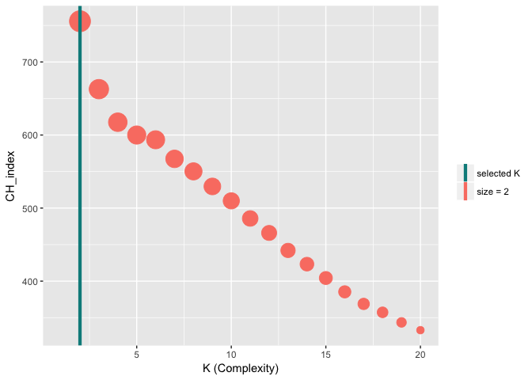
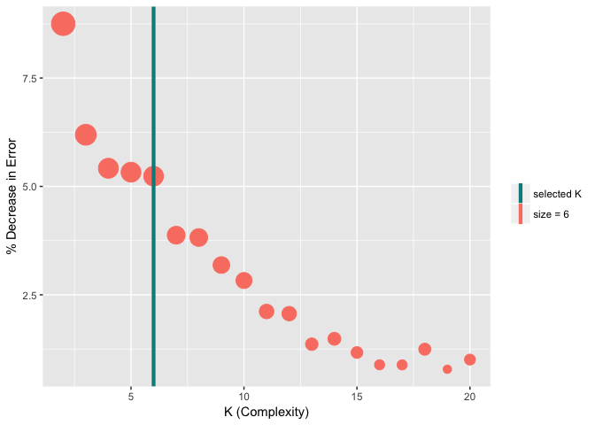
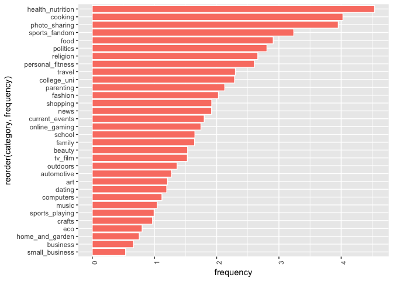
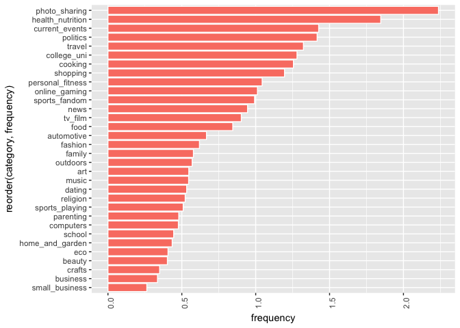
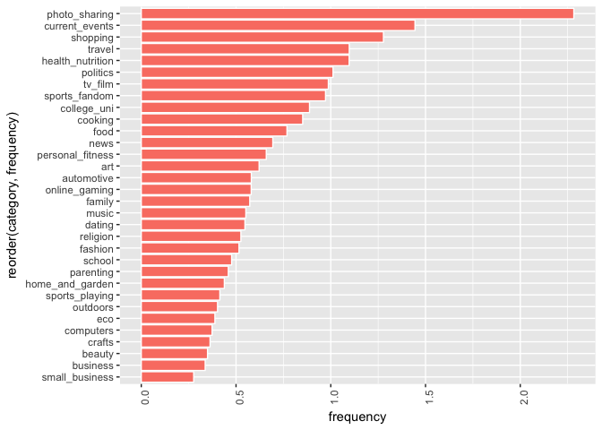
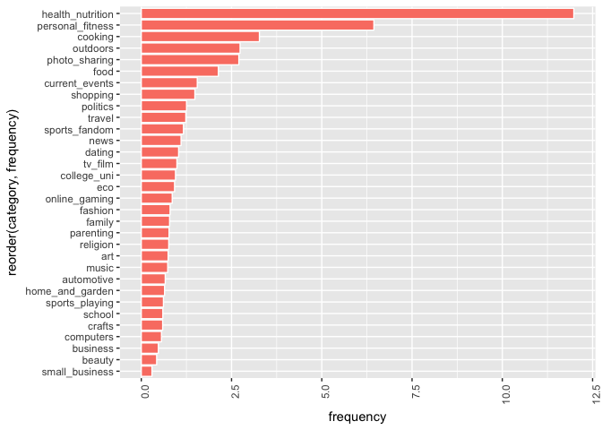
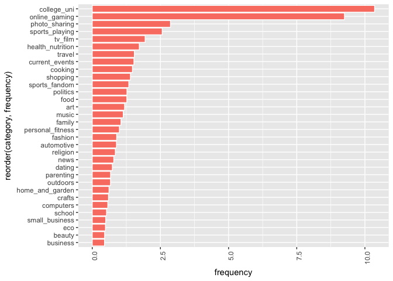
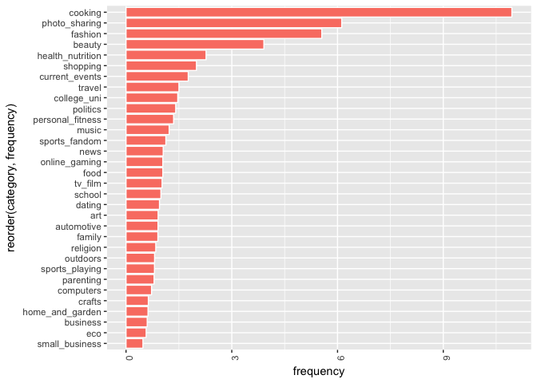

Market Segmentation
===================

Descriptives and Initial Analysis
=================================

    #have a brief idea of the data
    mkt = read.csv("~/Downloads/social_marketing.csv")
    dim(mkt)

    ## [1] 7882   37

    set.seed(123)
    library(ggplot2)

    #change the first column into index
    mkt2 = mkt[,-1]
    rownames(mkt2) <- mkt[,1]

    #drop some categories that are not meaningful
    drops <- c("chatter", "uncategorized", "spam", "adult")
    mkt3 = mkt2[ , !(names(mkt2) %in% drops)]

    #get an initial look at the frequencies of each category
    sum = colSums(mkt3)
    sum2 = sort(sum, decreasing = TRUE)
    sum2

    ##    photo_sharing health_nutrition          cooking         politics 
    ##            21256            20235            15750            14098 
    ##    sports_fandom           travel      college_uni   current_events 
    ##            12564            12493            12213            12030 
    ## personal_fitness             food         shopping    online_gaming 
    ##            11524            11015            10951             9528 
    ##             news         religion          tv_film          fashion 
    ##             9502             8634             8436             7855 
    ##        parenting           family       automotive         outdoors 
    ##             7262             6809             6541             6169 
    ##           school              art           dating           beauty 
    ##             6051             5713             5603             5558 
    ##            music        computers   sports_playing  home_and_garden 
    ##             5354             5116             5038             4104 
    ##           crafts              eco         business   small_business 
    ##             4066             4038             3336             2651

    #scale the data
    mkt_scaled <- scale(mkt3, center=TRUE, scale=TRUE) 

Decide how many clusters we should use
======================================

    # Use different methods to decide how many clusters we should use
    # CH index method: try to maximize the CH index
    error_vec <- rep(0,20)
    ch_index <- rep(0,20)
    # clusplot(social, social_cluster$cluster, color = T, shade = T, labels = 0, lines = 0)
    for(k in 1:20) {
        social_cluster <- kmeans(mkt_scaled, k, nstart = 25)
        error_vec[k] <- social_cluster$tot.withinss
        ch_index[k] <-(sum(social_cluster$betweenss)/(k - 1))/(sum(social_cluster$withinss)/(sum(social_cluster$size)- k))
    }

    ## Warning: did not converge in 10 iterations

    ## Warning: did not converge in 10 iterations

    ## Warning: did not converge in 10 iterations

    ## Warning: did not converge in 10 iterations

    ## Warning: did not converge in 10 iterations

    ## Warning: did not converge in 10 iterations

    ch_index <- data.frame(ch_index)
    ch_index <- cbind(1:nrow(ch_index),ch_index)
    colnames(ch_index) <- c("K","CH_index")
    ggplot(ch_index, aes(x=K, y = CH_index)) + geom_point(aes(size = CH_index,color = "size = 2"),show.legend = FALSE) + xlab("K (Complexity)") +ylab("CH_index")+ scale_size_continuous(range = c(3, 9)) + geom_vline(aes(xintercept=2,colour="selected K") ,size =1.5) + 
    scale_colour_manual(name="",values=c("selected K"= "cyan4", "size = 2"="salmon"))

    ## Warning in sqrt(x): NaNs produced

    ## Warning: Removed 1 rows containing missing values (geom_point).

When using the CH index to decide the optimal number of clusters, we
need to maximize the CH index to achieve the balance between fit and
complexity. The graph above suggests that we need to use 2 clusters in
the kmeans clustering method.

    # Use the percentage reduction method
    error_vec_shift <- c(0,error_vec)[-21]
    percent_change <- data.frame((1-(error_vec/error_vec_shift))[-1]*100)
    percent_change <- cbind(2:length(error_vec),percent_change)
    colnames(percent_change) <- c("K","Percent_Change")
    ggplot(percent_change, aes(x=K, y = Percent_Change)) + geom_point(aes(size = Percent_Change,color = "size = 6"),show.legend = FALSE) + xlab("K (Complexity)") +ylab("% Decrease in Error")+ scale_size_continuous(range = c(3, 9)) + geom_vline(aes(xintercept=6,colour="selected K") ,size =1.5) + 
    scale_colour_manual(name="",values=c("selected K"= "cyan4", "size = 6"="salmon"))

When using the percentage reducation method, we try to choose the number
of clusters that reduces the error percentage the most. Each dot in the
graph means the change from n cluster to n+1 cluster. Result suggests
that when the cluster increases from 5 to 6, the error percentage
decreases the most. Then, we should use 6 clusters.

    # find the best k using elbow function
    wss <- (nrow(mkt_scaled)-1)*sum(apply(mkt_scaled,2,var))
    for (i in 2:15) wss[i] <- sum(kmeans(mkt_scaled, centers=i)$withinss)

    wss <- data.frame(wss)
    wss <- cbind(1:nrow(wss),wss)
    colnames(wss) <- c("K","wss")
    ggplot(wss, aes(x=K, y = wss)) + geom_point(aes(size = wss,color = "size = 10"),show.legend = FALSE) + xlab("K (Complexity)") +ylab("Within groups sum of squares")+ scale_size_continuous(range = c(3, 9)) + geom_vline(aes(xintercept=10,colour="selected K") ,size =1.5) + 
    scale_colour_manual(name="",values=c("selected K"= "cyan4", "size = 10"="salmon"))

When looking within groups sum of squares, we find difficult to decide
the optimal number of ks to use as the cutoff. As when there are more
clusters, the within groups of squared error would decrease. However,
since this curve is convex, and the slope after k=10 becomes more
flatter. So we feel that k=10 is the optimal for this method. However,
since we only have 32 categories after cleaning, and 10 clusters are too
many.

Therefore, we decide to look at two conditions, where k equals 2 and 6
separately, and discuss the market segmentation.

Use 2 clusters
==============

    #use 2 clusters
    cluster_all_2 <- kmeans(mkt_scaled, centers=2, nstart=50)

    #add cluster to original data
    mkt3$cluster <- as.numeric(cluster_all_2$cluster)

    #Frequency of each cluster
    table(mkt3$cluster)

    ## 
    ##    1    2 
    ## 2111 5771

    #creating individual datasets for analysis 
    #drop the four useless categories
    social_group1_2cluster = mkt[mkt3$cluster==1,c(2:37)]
    social_group1_2cluster = social_group1_2cluster[ , !(names(social_group1_2cluster) %in% drops)]

    social_group2_2cluster = mkt[mkt3$cluster==2,c(2:37)]
    social_group2_2cluster = social_group2_2cluster[ , !(names(social_group2_2cluster) %in% drops)]

    #plot each group: group 1

    #sort the frequency for each category
    mean_social_group1_2cluster = apply(social_group1_2cluster, MARGIN=2, FUN=mean)
    mean_social_group1_2cluster= sort(mean_social_group1_2cluster, decreasing = TRUE)
    mean_social_group1_2cluster = data.frame(cbind(names(mean_social_group1_2cluster),unname(mean_social_group1_2cluster)))

    colnames(mean_social_group1_2cluster) <- c("category", "frequency")
    mean_social_group1_2cluster$frequency <- as.numeric(as.character(mean_social_group1_2cluster$frequency))

    # plot
    ggplot(mean_social_group1_2cluster, aes(x=reorder(category,frequency),y=frequency)) + geom_bar(stat = 'identity', fill = "salmon", color ="white")+ coord_flip() + theme(axis.text.x = element_text(angle=90, hjust=1))

> category: health\_nutrition, cooking, photo\_sharing, sports\_fandom
> market segmentation: well-educated people, especially young people

    #plot each group: group 2

    #sort the frequency for each category
    mean_social_group2_2cluster = apply(social_group2_2cluster, MARGIN=2, FUN=mean)
    mean_social_group2_2cluster= sort(mean_social_group2_2cluster, decreasing = TRUE)
    mean_social_group2_2cluster = data.frame(cbind(names(mean_social_group2_2cluster),unname(mean_social_group2_2cluster)))

    colnames(mean_social_group2_2cluster) <- c("category", "frequency")
    mean_social_group2_2cluster$frequency <- as.numeric(as.character(mean_social_group2_2cluster$frequency))

    # plot
    ggplot(mean_social_group2_2cluster, aes(x=reorder(category,frequency),y=frequency)) + geom_bar(stat = 'identity', fill = "salmon", color ="white")+ coord_flip() + theme(axis.text.x = element_text(angle=90, hjust=1))

&gt; category: photo\_sharing, health\_nutrition, current\_events,
politics, travel, cooking, college\_uni &gt; market segmentation:

Use 6 clusters:
===============

    #use 10 clusters
    cluster_all_6cluster <- kmeans(mkt_scaled, centers=6, nstart=50)

    #add cluster to original data
    mkt3$cluster <- as.numeric(cluster_all_6cluster$cluster)

    #Frequency of each cluster
    table(mkt3$cluster)

    ## 
    ##    1    2    3    4    5    6 
    ## 4522  687  889  453  569  762

    #creating individual datasets for analysis 
    #drop the four useless categories
    social_group1_6cluster = mkt[mkt3$cluster==1,c(2:37)]
    social_group1_6cluster = social_group1_6cluster[ , !(names(social_group1_6cluster) %in% drops)]

    social_group2_6cluster = mkt[mkt3$cluster==2,c(2:37)]
    social_group2_6cluster = social_group2_6cluster[ , !(names(social_group2_6cluster) %in% drops)]

    social_group3_6cluster = mkt[mkt3$cluster==3,c(2:37)]
    social_group3_6cluster = social_group3_6cluster[ , !(names(social_group3_6cluster) %in% drops)]

    social_group4_6cluster = mkt[mkt3$cluster==4,c(2:37)]
    social_group4_6cluster = social_group4_6cluster[ , !(names(social_group4_6cluster) %in% drops)]

    social_group5_6cluster = mkt[mkt3$cluster==5,c(2:37)]
    social_group5_6cluster = social_group5_6cluster[ , !(names(social_group5_6cluster) %in% drops)]

    social_group6_6cluster = mkt[mkt3$cluster==6,c(2:37)]
    social_group6_6cluster = social_group6_6cluster[ , !(names(social_group6_6cluster) %in% drops)]

    #plot each group: group 1

    #sort the frequency for each category
    mean_social_group1_6cluster = apply(social_group1_6cluster, MARGIN=2, FUN=mean)
    mean_social_group1_6cluster= sort(mean_social_group1_6cluster, decreasing = TRUE)
    mean_social_group1_6cluster = data.frame(cbind(names(mean_social_group1_6cluster),unname(mean_social_group1_6cluster)))

    colnames(mean_social_group1_6cluster) <- c("category", "frequency")
    mean_social_group1_6cluster$frequency <- as.numeric(as.character(mean_social_group1_6cluster$frequency))

    # plot
    ggplot(mean_social_group1_6cluster, aes(x=reorder(category,frequency),y=frequency)) + geom_bar(stat = 'identity', fill = "salmon", color ="white")+ coord_flip() + theme(axis.text.x = element_text(angle=90, hjust=1))

> category: college\_uni, online\_gaming market segmentation: univeristy
> students, especially boys

    #plot each group: group 2

    #sort the frequency for each category
    mean_social_group2_6cluster = apply(social_group2_6cluster, MARGIN=2, FUN=mean)
    mean_social_group2_6cluster= sort(mean_social_group2_6cluster, decreasing = TRUE)
    mean_social_group2_6cluster = data.frame(cbind(names(mean_social_group2_6cluster),unname(mean_social_group2_6cluster)))

    colnames(mean_social_group2_6cluster) <- c("category", "frequency")
    mean_social_group2_6cluster$frequency <- as.numeric(as.character(mean_social_group2_6cluster$frequency))

    # plot
    ggplot(mean_social_group2_6cluster, aes(x=reorder(category,frequency),y=frequency)) + geom_bar(stat = 'identity', fill = "salmon", color ="white")+ coord_flip() + theme(axis.text.x = element_text(angle=90, hjust=1))

> category: sports\_fandom, religion, food, parenting market
> segmentation: young parents

    #plot each group: group 3

    #sort the frequency for each category
    mean_social_group3_6cluster = apply(social_group3_6cluster, MARGIN=2, FUN=mean)
    mean_social_group3_6cluster= sort(mean_social_group3_6cluster, decreasing = TRUE)
    mean_social_group3_6cluster = data.frame(cbind(names(mean_social_group3_6cluster),unname(mean_social_group3_6cluster)))

    colnames(mean_social_group3_6cluster) <- c("category", "frequency")
    mean_social_group3_6cluster$frequency <- as.numeric(as.character(mean_social_group3_6cluster$frequency))

    # plot
    ggplot(mean_social_group3_6cluster, aes(x=reorder(category,frequency),y=frequency)) + geom_bar(stat = 'identity', fill = "salmon", color ="white")+ coord_flip() + theme(axis.text.x = element_text(angle=90, hjust=1))

> category: health\_nutrition, personal\_fitness, cooking, outdoors,
> photo\_sharing market segmentation: people who cares fitness

    #plot each group: group 4

    #sort the frequency for each category
    mean_social_group4_6cluster = apply(social_group4_6cluster, MARGIN=2, FUN=mean)
    mean_social_group4_6cluster= sort(mean_social_group4_6cluster, decreasing = TRUE)
    mean_social_group4_6cluster = data.frame(cbind(names(mean_social_group4_6cluster),unname(mean_social_group4_6cluster)))

    colnames(mean_social_group4_6cluster) <- c("category", "frequency")
    mean_social_group4_6cluster$frequency <- as.numeric(as.character(mean_social_group4_6cluster$frequency))

    # plot
    ggplot(mean_social_group4_6cluster, aes(x=reorder(category,frequency),y=frequency)) + geom_bar(stat = 'identity', fill = "salmon", color ="white")+ coord_flip() + theme(axis.text.x = element_text(angle=90, hjust=1))

> category: politics, travel, news market segmentation: well-educated
> people, especailly male

    #plot each group: group 5

    #sort the frequency for each category
    mean_social_group5_6cluster = apply(social_group5_6cluster, MARGIN=2, FUN=mean)
    mean_social_group5_6cluster= sort(mean_social_group5_6cluster, decreasing = TRUE)
    mean_social_group5_6cluster = data.frame(cbind(names(mean_social_group5_6cluster),unname(mean_social_group5_6cluster)))

    colnames(mean_social_group5_6cluster) <- c("category", "frequency")
    mean_social_group5_6cluster$frequency <- as.numeric(as.character(mean_social_group5_6cluster$frequency))

    # plot
    ggplot(mean_social_group5_6cluster, aes(x=reorder(category,frequency),y=frequency)) + geom_bar(stat = 'identity', fill = "salmon", color ="white")+ coord_flip() + theme(axis.text.x = element_text(angle=90, hjust=1))

> category: cooking, photo\_sharing, fashion, beauty market
> segmentation: young ladies

    #plot each group: group 6

    #sort the frequency for each category
    mean_social_group6_6cluster = apply(social_group6_6cluster, MARGIN=2, FUN=mean)
    mean_social_group6_6cluster= sort(mean_social_group6_6cluster, decreasing = TRUE)
    mean_social_group6_6cluster = data.frame(cbind(names(mean_social_group6_6cluster),unname(mean_social_group6_6cluster)))

    colnames(mean_social_group6_6cluster) <- c("category", "frequency")
    mean_social_group6_6cluster$frequency <- as.numeric(as.character(mean_social_group6_6cluster$frequency))

    # plot
    ggplot(mean_social_group6_6cluster, aes(x=reorder(category,frequency),y=frequency)) + geom_bar(stat = 'identity', fill = "salmon", color ="white")+ coord_flip() + theme(axis.text.x = element_text(angle=90, hjust=1))

> category: photo\_sharing, current\_events, shopping market
> segmentation: female who like fashion

In conclusion,
==============
