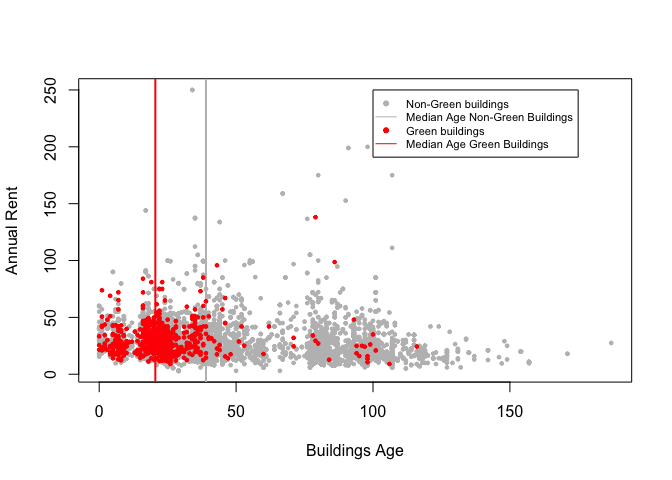

Probability
===========

Part A
------

We know          <i>P(RC)+P(TC)=1</i> 

and        <i>P(Yes)=P(Yes|RC)∗P(RC)+P(Yes|TC)∗P(TC)</i> 

Then we have:        <i>0.65=0.5∗0.3+P(Yes|TC)∗0.7</i> 

Therefore:        <i>P(Yes|TC)=71.4%</i> 

PartB
-----

Since <i>P(disease) + P(nodisease)=1 </i> 

<i>P(positive)=P(positive|disease)∗P(disease)+P(positive|nodisease)∗P(nodisease) 
                  =0.993∗0.000025+0.0001∗0.999975 
                  =0.0001248225</i>

According to Bayes Rules  <i>
P(disease|positive)=P(disease,positive)/P(positive) 
                               =P(positive|disease)∗P(disease)/P(positive) 
                               =0.993∗0.0000250/0001248225 
                               =0.1988824</i>

Given a positive test result, there is a 19.89% chance that they have
the disease.

Since P(disease|positive) is low, a universal test for the disease may
cause unnecessary concerns.

Green Building
==============

> I began by cleaning the data a little bit. In particular, I noticed
> that a handful of the buildings in the data set had very low occupancy
> rates (less than 10% of available space occupied). I decided to remove
> these buildings from consideration, on the theory that these buildings
> might have something weird going on with them, and could potentially
> distort the analysis.

Is this data cleaning step necessary? We looked into the distribution of
leasing rate of green buildings and non-green buildings. Interestingly,
the distribution of non-green buildings' leasing rate has a shoot up in
the range below 10%. Therefore, we hold the same belief that these
buildings are "weird" and should be removed from our analysis.

    par(mfrow=c(1,2))
    hist(green_buildings$leasing_rate, main="Green Buildings", xlab="Leasing Rate", ylab = "")
    hist(non_green_buildings$leasing_rate, main="Non-Green Buildings", xlab="Leasing Rate", ylab="", 
         col=c('red', rep('white',9)))

> The median market rent in the non-green buildings was $25 per square
> foot per year, while the median market rent in the green buildings was
> $27.60 per square foot per year: about $2.60 more per square foot.

The way the author calculates the premium rent for green buildings is
too generic as there are confounding variables. It is important to
control the confounding variables in our analysis so that we can see how
the green rating influences the rent. Age is one of the confounding
variables. As shown in the plot, green buildings are highly concentrated
in the lower range of age, which means they are relatively new, thus
having higher rent. We decided to analyze the buildings with ages less
than 50.

    green_median = green_buildings[green_buildings$Rent == median(green_buildings$Rent),]
    nongreen_median = non_green_buildings[non_green_buildings$Rent == median(non_green_buildings$Rent),]
    plot(non_green_buildings$age, non_green_buildings$Rent, col="grey", pch=19, cex=0.5, xlab = "Buildings Age", ylab="Annual Rent") 
    abline(v=median(nongreen_median$age),col='grey',lwd=2)
    abline(v=median(green_median$age),col='red',lwd=2)
    points(green_buildings$age, green_buildings$Rent, col="red", pch=19, cex=0.5)
    legend(x=100,y=250,cex=0.7,legend=c('Non-Green buildings','Median Age Non-Green Buildings','Green buildings','Median Age Green Buildings'),lty=c(NA,1,NA,1),pch=c(19,NA,19,NA),col=c('grey','grey','red','red'))

Another confounding variable is class. As shown in charts below, class A
buildings have a definite premium rent over other classes and green
buildings have an enormously high percentage falling into class A and
class B. Therefore, we removed buildings in class C in our analysis.

    buildings$class = ifelse(buildings$class_a==1, 1, ifelse(buildings$class_b==1, 2, 3))
    boxplot(buildings$Rent~buildings$class,outline=FALSE,boxwex=0.5, col=c('gold2','gold2','gold2'), names = c("Class A", "Class B", "Class C"), main="Rent vs. Class")

    par(mfrow=c(1,2))

    pie_chart = table(buildings$green_rating, buildings$class)
    pie(pie_chart[2,], labels = c('Class A: 80%', 'Class B: 19%', 'Class C: 1%'), col=c('deepskyblue','gold','grey'), main="Green Buildings", init.angle = 150)
    pie(pie_chart[1,], labels = c('Class A: 36%', 'Class B: 48%', 'Class C: 16%'), col=c('deepskyblue','gold','grey'), main="Non-green Buildings", init.angle  = 90)

    green_buildings_con = subset(green_buildings, age<=50 & (class_a==1 | class_b==1))
    non_green_buildings_con = subset(non_green_buildings, age<=50 & (class_a==1 | class_b==1))

Then we calculate how much the premium in rent is brought by green
rating. We first group the buildings based on cluster, and then
calculate the difference between the median of green building's rent and
that of non-green buildings within the same cluster. The mean of
difference among all clusters is 2.2 which is our expected premium rent.

    non_green_clusters<- non_green_buildings_con%>%
      group_by(cluster)%>%
      summarise(rent_mean = mean(Rent),
                rent_median = median(Rent))
    green_clusters<- green_buildings_con%>%
      group_by(cluster)%>%
      summarise(rent_mean_g = mean(Rent),
                rent_median_g = median(Rent))
    rent_clusters = merge(x=non_green_clusters, y=green_clusters, by="cluster", all.y = TRUE)
    rent_clusters$median_premium = rent_clusters$rent_median_g - rent_clusters$rent_median
    mean(rent_clusters$median_premium, na.rm = TRUE)

    ## [1] 2.201897

Further in the report:

> Based on the extra revenue we would make, we would recuperate these
> costs in $5000000/650000 = 7.7 years. Even if our occupancy rate were
> only 90%, we would still recuperate the costs in a little over 8
> years.

It is such a strong assumption that it assumes a constant leasing rate
and constant rent over the life cycle of the building. Is that true? We
create a new factor, <i>LR</i>, which is <i>leasing\_rate × Rent</i>.
With a fixed building size, this feature is proportional to the total
leasing revenue. How does it change with age? We selected buildings less
than 50 years old and in class A or B and here is the plot:

    buildings_con = subset(buildings, age<=50&(class_a==1 | class_b==1))
    buildings_con$LR = buildings_con$leasing_rate * buildings_con$Rent
    model = train.kknn(LR ~ age, data = buildings_con, ks= 20)
    newdata = as.data.frame(seq(1, 50))
    colnames(newdata) = c("age")
    predictions = predict(model, newdata)
    plot(buildings_con$age, buildings_con$LR,pch=19, cex=0.8,ylab= "LR", xlab="Age", col="darkgray", main = "Total revenue")
    lines(newdata$age, predictions, type="l", col='red', lwd=2)
    legend(32, 20000, c("KNN Regression"), lwd=2.5,col="red")

Each building is a gray dot in the plot. We draw a line with KNN (k set
to 20) to show a smooth general trend of LR over age. It turns out that
the total revenue doesn't go down with an increasing age. Therefore, we
could assume that the 2.2 premium for green rating holds for at least
the first 50 years. And for the occupancy rate:

    hist(green_buildings_con$leasing_rate, breaks = 50, xlim=c(50, 100), ylab='', main='Leasing Rate for Green Buildings', xlab='')

The leasing rate for green buildings is highly left-skewed, so the
median is a better estitamation for our building, which is 92.9%.
Besides revenue, the cost for green buildings could potentially be
higher than non-green ones. Without enough information to quantify that,
we assume that the extra cost is about 5% of total revenue. The median
of green buildings' rent is $30, which makes the cost $1.5.

Therefore, the annual extra revenue from green rating is ($2.2-$1.5) ×
92.9% × 250,000 (size) = $162,757 and it needs $5,000,000 / $162,757 =
30 years to recuperate the extra cost. 30 years as the payback period of
an investment is too long and makes the company exposed to industry
fluctuations and external risks. We would suggest not building the green
building.

Bootstrapping
=============

    mystocks <- c("SPY", "TLT", "LQD", "EEM", "VNQ")
    getSymbols(mystocks)

    ## [1] "SPY" "TLT" "LQD" "EEM" "VNQ"

    SPYa <- adjustOHLC(SPY)
    TLTa <- adjustOHLC(TLT)
    LQDa <- adjustOHLC(LQD)
    EEMa <- adjustOHLC(EEM)
    VNQa <- adjustOHLC(VNQ)
    myreturns <- cbind(ClCl(SPY),ClCl(TLT),ClCl(LQD),ClCl(EEM),ClCl(VNQ))
    myreturns <- as.matrix(na.omit(myreturns))

    #Find the mean and standard deviation for each asset
    asset_return <- sort(apply(myreturns, 2,mean))
    asset_risk <- sort(apply(myreturns, 2, sd))

### Expected Return for each asset

    pander(asset_return)

<table style="width:82%;">
<colgroup>
<col width="16%" />
<col width="15%" />
<col width="16%" />
<col width="16%" />
<col width="16%" />
</colgroup>
<thead>
<tr class="header">
<th align="center">ClCl.LQD</th>
<th align="center">ClCl.TLT</th>
<th align="center">ClCl.EEM</th>
<th align="center">ClCl.VNQ</th>
<th align="center">ClCl.SPY</th>
</tr>
</thead>
<tbody>
<tr class="odd">
<td align="center">5.953e-05</td>
<td align="center">0.000177</td>
<td align="center">0.0002381</td>
<td align="center">0.0002598</td>
<td align="center">0.0002747</td>
</tr>
</tbody>
</table>

Now, we rank the five asset from lowest return to highest return based
on sample mean.

### Standard deviation of return for each asset

    pander(asset_risk)

<table style="width:76%;">
<colgroup>
<col width="15%" />
<col width="15%" />
<col width="15%" />
<col width="15%" />
<col width="15%" />
</colgroup>
<thead>
<tr class="header">
<th align="center">ClCl.LQD</th>
<th align="center">ClCl.TLT</th>
<th align="center">ClCl.SPY</th>
<th align="center">ClCl.EEM</th>
<th align="center">ClCl.VNQ</th>
</tr>
</thead>
<tbody>
<tr class="odd">
<td align="center">0.005466</td>
<td align="center">0.009422</td>
<td align="center">0.01281</td>
<td align="center">0.02058</td>
<td align="center">0.02202</td>
</tr>
</tbody>
</table>

Here, we rank them from lowest risk to highest risk based on sample
standard deviations of the assets.

From the above tables, we can classify our assets into different
categories. Any assets below the 3rd rank will be given a score low.
Those above the third rank will be given a score high, and the middle
rank will be given a score medium.

**SPY** - High return/ Medium risk

**TLT** - Medium return/ Low risk

**LQD** - Low return/ Low risk

**EEM** - Low return/ High risk

**VNQ** - High return/ High risk

    plot(asset_return, asset_risk, pch = 19, cex = 3.5, col = "salmon", xlab = "Expected Return", ylab = "Risk(Standard Devation)",ylim = c(0,0.025), main = "Risk vs Return")
    text(asset_return[1],asset_risk[1]+0.002, "LQD")
    text(asset_return[2],asset_risk[2]+0.002, "TLT")
    text(asset_return[3],asset_risk[3]+0.002, "EEM")
    text(asset_return[4],asset_risk[4]+0.002, "VNQ")
    text(asset_return[5],asset_risk[5]+0.002, "SPY")

    #Create a function to simulate 20 trading day
    sim_stock <- function(myreturns, investment, endperiod, weights, num_sim){
        sim_result <- foreach(i=1:num_sim, .combine='rbind') %do% {
            totalwealth <- investment #reset totalwealth for every simulation
            horizon <- endperiod
            holdings <- weights * totalwealth
            for (today in 1:horizon) {
                return_today <- resample(myreturns, 1, orig.ids = FALSE)
                holdings <- holdings + return_today * holdings
                totalwealth <- sum(holdings)
                holdings <- weights * totalwealth #end of day. redistribute the wealth
            }
            totalwealth
        }
    }

### Setting values for our simulation

We have 100,000 to invest, and we will do our simulation for 20 days.

    investment <- 100000
    endperiod <- 20

For each of the strategy, we will adjust the weight accordingly.

### Even Split Strategy

We will assign equal weights to all five assets

    set.seed(1)
    weights <- c(0.2,0.2,0.2,0.2,0.2)
    even_strategy <- sim_stock(myreturns, investment, endperiod, weights, 3000)
    names(weights) <- mystocks
    pander(weights)

<table style="width:42%;">
<colgroup>
<col width="8%" />
<col width="8%" />
<col width="8%" />
<col width="8%" />
<col width="8%" />
</colgroup>
<thead>
<tr class="header">
<th align="center">SPY</th>
<th align="center">TLT</th>
<th align="center">LQD</th>
<th align="center">EEM</th>
<th align="center">VNQ</th>
</tr>
</thead>
<tbody>
<tr class="odd">
<td align="center">0.2</td>
<td align="center">0.2</td>
<td align="center">0.2</td>
<td align="center">0.2</td>
<td align="center">0.2</td>
</tr>
</tbody>
</table>

**Weight of each stock for the even split strategy**

### Safe Strategy

For this strategy, we will look at our classification of the five assets
and choose those with low risk properties. We will also include one
medium risk asset. For the weight, we will use 1/standard deviation as
the coefficients and normalize them to add up to 1. SPY, TLT, and LQD
are the three chosen assets.

    set.seed(1)
    spy_coef <- 1/asset_risk[3]
    tlt_coef <- 1/asset_risk[2]
    lqd_coef <- 1/ asset_risk[1]
    total_coef <- spy_coef + tlt_coef + lqd_coef
    spy_coef <- spy_coef/total_coef
    tlt_coef <- tlt_coef/total_coef
    lqd_coef <- lqd_coef/total_coef
    weights <- c(spy_coef, tlt_coef,lqd_coef, 0, 0)
    safe_strategy <- sim_stock(myreturns, investment, endperiod, weights, 3000)
    names(weights) <- mystocks
    pander(weights)

<table style="width:54%;">
<colgroup>
<col width="12%" />
<col width="12%" />
<col width="12%" />
<col width="8%" />
<col width="8%" />
</colgroup>
<thead>
<tr class="header">
<th align="center">SPY</th>
<th align="center">TLT</th>
<th align="center">LQD</th>
<th align="center">EEM</th>
<th align="center">VNQ</th>
</tr>
</thead>
<tbody>
<tr class="odd">
<td align="center">0.2127</td>
<td align="center">0.2891</td>
<td align="center">0.4983</td>
<td align="center">0</td>
<td align="center">0</td>
</tr>
</tbody>
</table>

**Weight of each stock for the safe strategy**

### Aggressive Strategy

For this strategy, we will not be as diversified as the safe strategy.
Also, we will look mainly at assests which have high returns with
moderate to high risks. Coefficients will be adjusted based on the
expected return values. We will invest in SPY and VNQ

    set.seed(1)
    total_coef_a <- asset_return[4] + asset_return[5]
    spy_coef_a <- asset_return[4]/total_coef_a
    vnq_coef_a <- asset_return[5]/total_coef_a
    weights <- c(spy_coef_a, 0, 0, 0, vnq_coef_a)
    aggressive_strategy <- sim_stock(myreturns, investment, endperiod, weights, 3000)
    names(weights) <- mystocks
    pander(weights)

<table style="width:49%;">
<colgroup>
<col width="12%" />
<col width="8%" />
<col width="8%" />
<col width="8%" />
<col width="11%" />
</colgroup>
<thead>
<tr class="header">
<th align="center">SPY</th>
<th align="center">TLT</th>
<th align="center">LQD</th>
<th align="center">EEM</th>
<th align="center">VNQ</th>
</tr>
</thead>
<tbody>
<tr class="odd">
<td align="center">0.4861</td>
<td align="center">0</td>
<td align="center">0</td>
<td align="center">0</td>
<td align="center">0.5139</td>
</tr>
</tbody>
</table>

**Weight of each stock for the aggressive strategy**

### Distribution of return values for even split strategy

    profit_split <- even_strategy - investment
    var05_split <- qdata(profit_split, 0.05)[2]
    hist(profit_split, 60,col = "cornsilk", xlab = "Return values", main = "Distribution of Return Values (Even Split Strategy)")
    abline(v = var05_split, col = "firebrick", lwd = 3)
    abline(v = mean(profit_split), col = "cyan4", lwd = 3)
    legend("topright", 
           c("5% value at risk", "expected return"), 
           lty=c(1, 1), 
           col=c("firebrick","cyan4"), 
           bty = "n")

    var_mean_split <- c(var05_split, mean(profit_split),sd(profit_split))
    names(var_mean_split) <- c("Value at Risk at 5%", "Expected Return", "Standard Deviation of Return")
    pander(var_mean_split)

<table style="width:97%;">
<colgroup>
<col width="30%" />
<col width="25%" />
<col width="41%" />
</colgroup>
<thead>
<tr class="header">
<th align="center">Value at Risk at 5%</th>
<th align="center">Expected Return</th>
<th align="center">Standard Deviation of Return</th>
</tr>
</thead>
<tbody>
<tr class="odd">
<td align="center">-6499</td>
<td align="center">482.7</td>
<td align="center">4451</td>
</tr>
</tbody>
</table>

This shows us that if investors invest for 20 traiding days for this
portfolio, 5 percent of the time they will suffer a loss of 6600.
However, on average, they will receive around 491.

**Quantile Values**

    pander(quantile(profit_split))

<table style="width:54%;">
<colgroup>
<col width="12%" />
<col width="11%" />
<col width="11%" />
<col width="9%" />
<col width="9%" />
</colgroup>
<thead>
<tr class="header">
<th align="center">0%</th>
<th align="center">25%</th>
<th align="center">50%</th>
<th align="center">75%</th>
<th align="center">100%</th>
</tr>
</thead>
<tbody>
<tr class="odd">
<td align="center">-17437</td>
<td align="center">-2357</td>
<td align="center">343.4</td>
<td align="center">3054</td>
<td align="center">23257</td>
</tr>
</tbody>
</table>

The table suggests that the return value in for 20 trading days can
range from a loss of 16958 to a gain of 21481.

### Distribution of return values for safe strategy

    profit_safe <- safe_strategy - investment
    var05_safe <- qdata(profit_safe, 0.05)[2]
    hist(profit_safe, 60,col = "cornsilk", xlab = "Return values", main = "Distribution of Return Values (Safe Strategy)")
    abline(v = var05_safe, col = "firebrick", lwd = 3)
    abline(v = mean(profit_safe), col = "cyan4", lwd = 3)
    legend("topright", 
           c("5% value at risk", "expected return"), 
           lty=c(1, 1), 
           col=c("firebrick","cyan4"), 
           bty = "n")

    var_mean_safe <- c(var05_safe, mean(profit_safe), sd(profit_safe))
    names(var_mean_safe) <- c("Value at Risk at 5%", "Expected Return", "Standard Deviation of Return")
    pander(var_mean_safe)

<table style="width:97%;">
<colgroup>
<col width="30%" />
<col width="25%" />
<col width="41%" />
</colgroup>
<thead>
<tr class="header">
<th align="center">Value at Risk at 5%</th>
<th align="center">Expected Return</th>
<th align="center">Standard Deviation of Return</th>
</tr>
</thead>
<tbody>
<tr class="odd">
<td align="center">-3115</td>
<td align="center">300.6</td>
<td align="center">2170</td>
</tr>
</tbody>
</table>

This shows us that if investors invest for 20 traiding days for this
portfolio, 5 percent of the time they will suffer a loss of 3218.
However, on average, they will receive around 261.

**Quantile Values**

    pander(quantile(profit_safe))

<table style="width:50%;">
<colgroup>
<col width="11%" />
<col width="11%" />
<col width="8%" />
<col width="9%" />
<col width="9%" />
</colgroup>
<thead>
<tr class="header">
<th align="center">0%</th>
<th align="center">25%</th>
<th align="center">50%</th>
<th align="center">75%</th>
<th align="center">100%</th>
</tr>
</thead>
<tbody>
<tr class="odd">
<td align="center">-8128</td>
<td align="center">-1033</td>
<td align="center">286</td>
<td align="center">1561</td>
<td align="center">11740</td>
</tr>
</tbody>
</table>

The table suggests that the return value in for 20 trading days can
range from a loss of 9046 to a gain of 8677.

### Distribution of return values for agressive strategy

    profit_aggressive <- aggressive_strategy - investment
    var05_aggressive <- qdata(profit_aggressive, 0.05)[2]
    hist(profit_aggressive, 60,col = "cornsilk", xlab = "Return values", main = "Distribution of Return Values (Aggressive Strategy)")
    abline(v = var05_aggressive, col = "firebrick", lwd = 3)
    abline(v = mean(profit_aggressive), col = "cyan4", lwd = 3)
    legend("topright", 
           c("5% value at risk", "expected return"), 
           lty=c(1, 1), 
           col=c("firebrick","cyan4"), 
           bty = "n")

    var_mean_aggressive <- c(var05_aggressive, mean(profit_aggressive), sd(profit_aggressive))
    names(var_mean_aggressive) <- c("Value at Risk at 5%", "Expected Return", "Standard Deviation of Return")
    pander(var_mean_aggressive)

<table style="width:97%;">
<colgroup>
<col width="30%" />
<col width="25%" />
<col width="41%" />
</colgroup>
<thead>
<tr class="header">
<th align="center">Value at Risk at 5%</th>
<th align="center">Expected Return</th>
<th align="center">Standard Deviation of Return</th>
</tr>
</thead>
<tbody>
<tr class="odd">
<td align="center">-11072</td>
<td align="center">641.9</td>
<td align="center">7516</td>
</tr>
</tbody>
</table>

This shows us that if investors invest for 20 traiding days for this
portfolio, 5 percent of the time they will suffer a loss of 11065.
However, on average, they will receive around 724.

**Quantile Values**

    pander(quantile(profit_aggressive))

<table style="width:54%;">
<colgroup>
<col width="12%" />
<col width="11%" />
<col width="11%" />
<col width="9%" />
<col width="9%" />
</colgroup>
<thead>
<tr class="header">
<th align="center">0%</th>
<th align="center">25%</th>
<th align="center">50%</th>
<th align="center">75%</th>
<th align="center">100%</th>
</tr>
</thead>
<tbody>
<tr class="odd">
<td align="center">-27853</td>
<td align="center">-4095</td>
<td align="center">467.6</td>
<td align="center">5170</td>
<td align="center">39342</td>
</tr>
</tbody>
</table>

The table suggests that the return value in for 20 trading days can
range from a loss of 26063 to a gain of 37979.

### Summary

    final_table <- data.frame(rbind(var_mean_split, var_mean_safe, var_mean_aggressive))
    rownames(final_table) <- c("Split Strategy","Safe Strategy", "Aggressive Strategy")
    colnames(final_table) <- c("Value at Risk at 5%", "Expected Return", "Standard Deviation of Return")
    pander(final_table)

<table style="width:90%;">
<caption>Table continues below</caption>
<colgroup>
<col width="36%" />
<col width="30%" />
<col width="23%" />
</colgroup>
<thead>
<tr class="header">
<th align="center"> </th>
<th align="center">Value at Risk at 5%</th>
<th align="center">Expected Return</th>
</tr>
</thead>
<tbody>
<tr class="odd">
<td align="center"><strong>Split Strategy</strong></td>
<td align="center">-6499</td>
<td align="center">482.7</td>
</tr>
<tr class="even">
<td align="center"><strong>Safe Strategy</strong></td>
<td align="center">-3115</td>
<td align="center">300.6</td>
</tr>
<tr class="odd">
<td align="center"><strong>Aggressive Strategy</strong></td>
<td align="center">-11072</td>
<td align="center">641.9</td>
</tr>
</tbody>
</table>

<table style="width:78%;">
<colgroup>
<col width="36%" />
<col width="41%" />
</colgroup>
<thead>
<tr class="header">
<th align="center"> </th>
<th align="center">Standard Deviation of Return</th>
</tr>
</thead>
<tbody>
<tr class="odd">
<td align="center"><strong>Split Strategy</strong></td>
<td align="center">4451</td>
</tr>
<tr class="even">
<td align="center"><strong>Safe Strategy</strong></td>
<td align="center">2170</td>
</tr>
<tr class="odd">
<td align="center"><strong>Aggressive Strategy</strong></td>
<td align="center">7516</td>
</tr>
</tbody>
</table>

Market Segmentation
===================

We delete the following four categories in order to make our market
segmentation more meaningful, spam, adult, uncategorize, and chatter.
Since adult and spam are categories that are supposed to be filtered and
contain improper contents, and uncategorize and chatter have no special
meanings. Therefore, we delete these four columns.

    discard<-c('spam','adult','uncategorize','chatter')
    social_market<-social_market[,!names(social_market)%in%discard]

Since certain high-frequency terms have little discriminating power like
photo-sharing, we use TF-IDF to recalculate the weight of each term for
every follower. TF stands for term-frequency, measuring how frequent a
term occurs in a follower's tweets: the more frequent a term occurs, the
more important it is to the follower; IDF stands for
inverse-document-frequency, measuring how frequent the term occurs in
the whole dataset: the more frequent a term occurs, the less important
it is to every follower.

    #TFIDF
    TF<-social_market[,-1]/rowSums(social_market[,-1])
    tmp=sort(apply(TF,2,mean),decreasing=TRUE)
    EXI_NUM<-apply(social_market[,-1]>0,2,function(x){table(x)['TRUE']})
    IDF<-as.numeric(log(nrow(social_market)/EXI_NUM))
    TFIDF = data.frame(t(t(TF)*IDF))

We use 'cosine' as a measurement for the similarity. It calculates the
cosine of the angle between two vectors It measures difference in
orientation instead of magnitude. For example, we have 3 follower A,B,C
with features like A={'travelling':10,'cooking':5},
B={'travelling':20,'cooking':10}, C={'travelling':10,'cooking':12}, we
would consider A more similar with B than C even though A and C are
'closer'.

    #hclust
    d.cosine<-dist(TFIDF,method='cosine')
    hc.ratio.cosine<-hclust(d.cosine,method='ward.D2')

By looking at different outputs of different Ks, we chose k=3 as our
final parameter since its output makes more sense to us.

    #hclust
    #choose cluster 3
    out.cluster = cutree(hc.ratio.cosine,k=3)
    TFIDF['cluster'] = out.cluster
    tfidf<-c()
    names<-c()
    for(j in 1:3){
        cate = sort(apply(TFIDF[TFIDF['cluster']==j,-ncol(TFIDF)],2,mean),decreasing=TRUE)[1:5]
        name = names(cate)
        tfidf<-c(tfidf,unname(cate))
        names<-c(names,name)
    }
    cate.df = data.frame(names=names,tfidf_scores=tfidf,cluster=c(rep('A',length(tfidf)/3),rep('C',length(tfidf)/3),rep('B',length(tfidf)/3)))
    cate.df$names<-factor(cate.df$names, levels=unique(cate.df$names))

    colourCount = length(unique(cate.df$names))
    getPalette = colorRampPalette(brewer.pal(11, "Spectral"))

    ggplot(cate.df,mapping=aes(x=cluster,y=tfidf_scores,fill=names))+geom_bar(stat='identity',position='dodge')+theme(panel.grid.minor=element_blank(),panel.grid.major=element_blank())+scale_fill_manual(values=getPalette(colourCount))+theme_bw()

    names_df<-data.frame('A'=cate.df$names[cate.df$cluster=='A'],'B'=cate.df$names[cate.df$cluster=='B'],'C'=cate.df$names[cate.df$cluster=='C'])
    pander(names_df)

<table style="width:67%;">
<colgroup>
<col width="26%" />
<col width="26%" />
<col width="13%" />
</colgroup>
<thead>
<tr class="header">
<th align="center">A</th>
<th align="center">B</th>
<th align="center">C</th>
</tr>
</thead>
<tbody>
<tr class="odd">
<td align="center">health_nutrition</td>
<td align="center">online_gaming</td>
<td align="center">politics</td>
</tr>
<tr class="even">
<td align="center">personal_fitness</td>
<td align="center">college_uni</td>
<td align="center">news</td>
</tr>
<tr class="odd">
<td align="center">outdoors</td>
<td align="center">sports_playing</td>
<td align="center">religion</td>
</tr>
<tr class="even">
<td align="center">cooking</td>
<td align="center">health_nutrition</td>
<td align="center">cooking</td>
</tr>
<tr class="odd">
<td align="center">food</td>
<td align="center">art</td>
<td align="center">shopping</td>
</tr>
</tbody>
</table>

From the topics of high TFIDF-socres in the clusters, we can infer that
first cluster represents people who care a lot about health and fitness,
mostly likely to be well-educated people and housewives; the second
cluster represents college/high school students; the third cluster
represents people who care about current events, most likely working
people.

Marketing strategy for each group:   <b>Cluster one</b>: We
recommend the company could post some healthy cooking recipes which use
company's products, and the company can cooperate with some famous chefs
to promote their products, such as Gordon Ramsay.   <b>Cluster
two</b>: The company should launch interesting social media campaigns to
attract this market segment, such as campaigns combining simple gaming
and promotions together.   <b>Cluster three</b>: The company can
sponsor some social events or even make some political contributions to
improce their social exposures on newspaper, TV and news website to
target this group.
