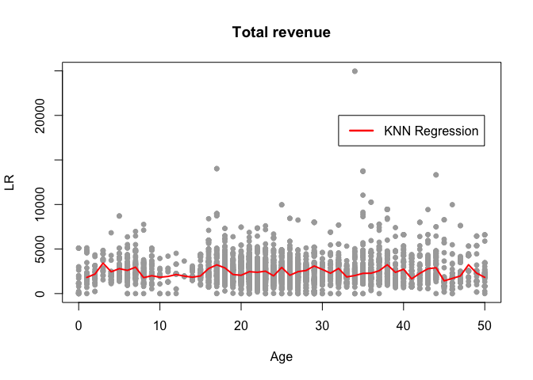

Green Building
--------------

> I began by cleaning the data a little bit. In particular, I noticed
> that a handful of the buildings in the data set had very low occupancy
> rates (less than 10% of available space occupied). I decided to remove
> these buildings from consideration, on the theory that these buildings
> might have something weird going on with them, and could potentially
> distort the analysis.

Is this data cleaning step neccesary? We looked into the distribution of
leasing rate of green buildings and non-green buildings. Interestingly,
the distribution of non-green buildings' leasing rate has a shoot up in
the range below 10%. Therefore, we hold the same belief that these
buildings are "weired" and should be removed from our analysis.

    par(mfrow=c(1,2))
    hist(green_buildings$leasing_rate, main="Green Buildings", xlab="Leasing Rate", ylab = "")
    hist(non_green_buildings$leasing_rate, main="Non-Green Buildings", xlab="Leasing Rate", ylab="", 
         col=c('red', rep('white',9)))

> The median market rent in the non-green buildings was $25 per square
> foot per year, while the median market rent in the green buildings was
> $27.60 per square foot per year: about $2.60 more per square foot.

The way the author calculates the premium rent for green buildings is
too generic as there are confounding variables. It is important to
control the confounding variables in our analysis so that we can see the
how green rating influences the rent. Age is one of the confounding
variables. As shown in the plot, green buildings are highly concentrated
in the lower range of age, which means they are relatively new, thus
higher rent. We decided to analyze the buildings with ages less than 50.

    plot(non_green_buildings$age, non_green_buildings$Rent, col="grey", pch=19, cex=0.5, xlab = "Buildings Age", ylab="Annual Rent") 
    points(green_buildings$age, green_buildings$Rent, col="red", pch=19, cex=0.5)
    legend(x = 120, y= 230, legend = c("Green Buildings", "Non-Green Buildings"), fill=c('red', 'grey'))

Another confounding variable is class. As shown in charts below, class A
buildings have a definite premium rent over other classes and green
buildings have an enormously high percentage falling into class A and
class B. Therefore, we removed buildings in class C in our analysis.

    buildings$class = ifelse(buildings$class_a==1, 1, ifelse(buildings$class_b==1, 2, 3))
    boxplot(buildings$Rent~buildings$class,outline=FALSE, names = c("Class A", "Class B", "Class C"), main="Rent vs. Class")

    par(mfrow=c(1,2))
    pie_chart = table(buildings$green_rating, buildings$class)
    pie(pie_chart[2,], labels = c('Class A', 'Class B', 'Class C'), col=c('azure3','azure2','azure1'), main="Green Buildings")
    pie(pie_chart[1,], labels = c('Class A', 'Class B', 'Class C'), col=c('azure3','azure2','azure1'), main="Non-green Buildings", init.angle  = 90)

    green_buildings_con = subset(green_buildings, age<=50 & (class_a==1 | class_b==1))
    non_green_buildings_con = subset(non_green_buildings, age<=50 & (class_a==1 | class_b==1))

Then we calculate the how much the premium in rent is brought by green
rating. We first group the buildings based on cluster, and then
calculate the difference between the green building's rent and the
meadian of non-green buildings within the same cluster. The mean of
difference among all clusters is 2.2 which is our expected premium rent.

    non_green_clusters<- non_green_buildings_con%>%
      group_by(cluster)%>%
      summarise(rent_mean = mean(Rent),
                rent_median = median(Rent))
    green_clusters<- green_buildings_con%>%
      group_by(cluster)%>%
      summarise(rent_mean_g = mean(Rent),
                rent_median_g = median(Rent))
    rent_clusters = merge(x=non_green_clusters, y=green_clusters, by="cluster", all.y = TRUE)
    rent_clusters$median_premium = rent_clusters$rent_median_g - rent_clusters$rent_median
    mean(rent_clusters$median_premium, na.rm = TRUE)

    ## [1] 2.201897

Further in the report:

> Based on the extra revenue we would make, we would recuperate these
> costs in $5000000/650000 = 7.7 years. Even if our occupancy rate were
> only 90%, we would still recuperate the costs in a little over 8
> years.

It is such a strong assumption that it assumes a constant leasing rate
and constant rent over the life cycle of the building. Is that true? We
create a new factor, <i>LR</i>, which is <i>leasing\_rate × Rent</i>.
With a fixed building size, this feature is proportional to the total
leasing revenue. How does it change with age? We selected buildings less
than 50 years old and in class A or B and here is the plot:

    library(kknn)
    buildings_con = subset(buildings, age<=50&(class_a==1 | class_b==1))
    buildings_con$LR = buildings_con$leasing_rate * buildings_con$Rent
    model = train.kknn(LR ~ age, data = buildings_con, ks= 20)
    newdata = as.data.frame(seq(1, 50))
    colnames(newdata) = c("age")
    predictions = predict(model, newdata)
    plot(buildings_con$age, buildings_con$LR,pch=19, cex=0.8,ylab= "LR", xlab="Age", col="darkgray", main = "Total revenue")
    lines(newdata$age, predictions, type="l", col='red', lwd=2)
    legend(32, 20000, c("KNN Regression"), lwd=2.5,col="red")

Each building is a gray dot in the plot. We draw a line with KNN (k set
to 20) to show a smooth general trend of LR over age. It turns out that
the total revenue doesn't go down with an increasing age. Therefore, we
could assume that the 2.2 premium for green rating holds for at least
the first 50 years. The annual extra revenue from green rating is 2.2 ×
250,000 (size) = $550,000 and it needs $5,000,000 / $550,000 = 9 years
to recuperate the extra cost. In summary, it is a profitable movement to
build a green rated building.
