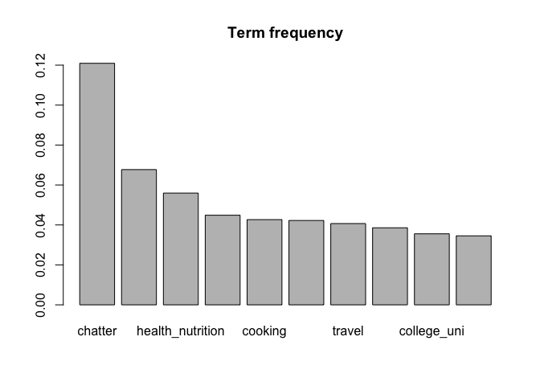
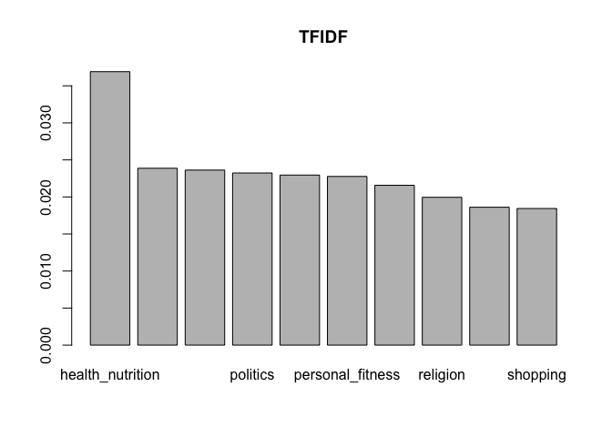
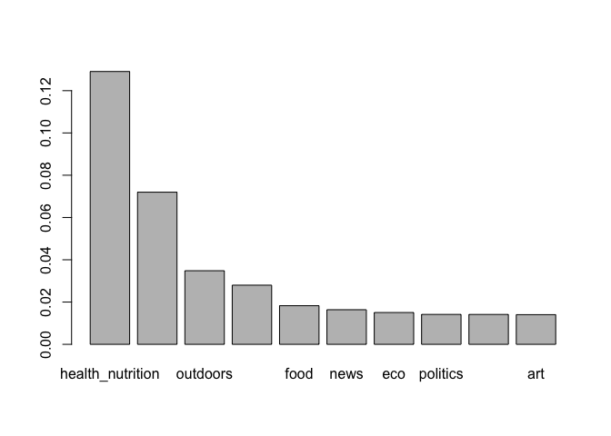
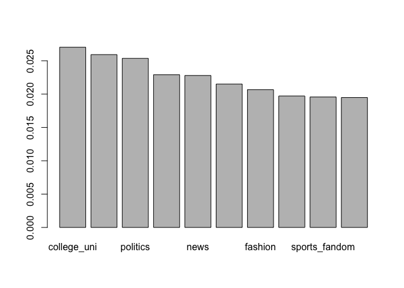

    social_market <- read.csv('~/Documents/SourceTree/STA380/data/social_marketing.csv')
    #Discard users whose most frequent tweets are adult/spam
    discard<-which(apply(social_market[,-1],1,function(x) x['spam']==max(x) || x['adult']==max(x)))
    social_market<-social_market[-discard,]

    #TF
    sum_raw<-apply(social_market[,-1],1,sum)
    TF<-social_market[,2:ncol(social_market)]/sum_raw
    sum_tf<-sort(apply(TF,2,mean),decreasing=TRUE)
    barplot(sum_tf[1:10],main='Term frequency')

    print(names(sum_tf[1:10]))

    ##  [1] "chatter"          "photo_sharing"    "health_nutrition"
    ##  [4] "current_events"   "cooking"          "politics"        
    ##  [7] "travel"           "sports_fandom"    "college_uni"     
    ## [10] "shopping"

    #TFIDF
    EXI_NUM<-apply(social_market[,-1]>0,2,function(x){table(x)['TRUE']})
    IDF<-as.numeric(log(nrow(social_market)/EXI_NUM))
    TFIDF = data.frame(t(t(TF)*IDF))
    mean_tfidf<-sort(apply(TFIDF,2,mean),decreasing=TRUE)
    barplot(mean_tfidf[1:10],main='TFIDF')

    print(names(mean_tfidf[1:10]))

    ##  [1] "health_nutrition" "cooking"          "college_uni"     
    ##  [4] "politics"         "online_gaming"    "personal_fitness"
    ##  [7] "news"             "religion"         "fashion"         
    ## [10] "shopping"

    #hclust
    d.cosine<-dist(TFIDF,method='cosine')
    hc.ratio.cosine<-hclust(d.cosine,method='ward.D2')

    ##This outputs detailed clusters from 2-5
    #will be taken out for the final submission
    for(i in 2:5){
      out.cluster = cutree(hc.ratio.cosine,k=i)
      TFIDF['cluster'] = out.cluster
      for(j in 1:i){
        cate = apply(TFIDF[TFIDF['cluster']==j,-1],2,sum)
        cate.sort = sort(cate[-length(cate)],decreasing=TRUE)
        print(names(cate.sort)[1:10])
        cat('\n')
      }
      cat('\n')
    }

    ##  [1] "health_nutrition" "personal_fitness" "outdoors"        
    ##  [4] "cooking"          "food"             "news"            
    ##  [7] "eco"              "politics"         "shopping"        
    ## [10] "art"             
    ## 
    ##  [1] "college_uni"   "online_gaming" "politics"      "cooking"      
    ##  [5] "news"          "religion"      "fashion"       "tv_film"      
    ##  [9] "sports_fandom" "dating"       
    ## 
    ## 
    ##  [1] "health_nutrition" "personal_fitness" "outdoors"        
    ##  [4] "cooking"          "food"             "news"            
    ##  [7] "eco"              "politics"         "shopping"        
    ## [10] "art"             
    ## 
    ##  [1] "politics"      "news"          "cooking"       "religion"     
    ##  [5] "fashion"       "dating"        "shopping"      "tv_film"      
    ##  [9] "sports_fandom" "art"          
    ## 
    ##  [1] "online_gaming"    "college_uni"      "sports_playing"  
    ##  [4] "health_nutrition" "art"              "personal_fitness"
    ##  [7] "tv_film"          "sports_fandom"    "food"            
    ## [10] "religion"        
    ## 
    ## 
    ##  [1] "health_nutrition" "personal_fitness" "outdoors"        
    ##  [4] "cooking"          "food"             "news"            
    ##  [7] "eco"              "politics"         "shopping"        
    ## [10] "art"             
    ## 
    ##  [1] "politics"      "news"          "religion"      "sports_fandom"
    ##  [5] "dating"        "tv_film"       "shopping"      "art"          
    ##  [9] "parenting"     "automotive"   
    ## 
    ##  [1] "online_gaming"    "college_uni"      "sports_playing"  
    ##  [4] "health_nutrition" "art"              "personal_fitness"
    ##  [7] "tv_film"          "sports_fandom"    "food"            
    ## [10] "religion"        
    ## 
    ##  [1] "cooking"          "fashion"          "beauty"          
    ##  [4] "health_nutrition" "photo_sharing"    "music"           
    ##  [7] "shopping"         "college_uni"      "online_gaming"   
    ## [10] "uncategorized"   
    ## 
    ## 
    ##  [1] "health_nutrition" "personal_fitness" "outdoors"        
    ##  [4] "cooking"          "food"             "news"            
    ##  [7] "eco"              "politics"         "shopping"        
    ## [10] "art"             
    ## 
    ##  [1] "religion"      "parenting"     "sports_fandom" "school"       
    ##  [5] "food"          "family"        "crafts"        "beauty"       
    ##  [9] "automotive"    "shopping"     
    ## 
    ##  [1] "politics"    "news"        "dating"      "tv_film"     "art"        
    ##  [6] "shopping"    "adult"       "travel"      "automotive"  "college_uni"
    ## 
    ##  [1] "online_gaming"    "college_uni"      "sports_playing"  
    ##  [4] "health_nutrition" "art"              "personal_fitness"
    ##  [7] "tv_film"          "sports_fandom"    "food"            
    ## [10] "religion"        
    ## 
    ##  [1] "cooking"          "fashion"          "beauty"          
    ##  [4] "health_nutrition" "photo_sharing"    "music"           
    ##  [7] "shopping"         "college_uni"      "online_gaming"   
    ## [10] "uncategorized"

    #hclust
    #choose cluster 2
    out.cluster = cutree(hc.ratio.cosine,k=2)
    TFIDF['cluster'] = out.cluster
    for(j in 1:2){
        cate = apply(TFIDF[TFIDF['cluster']==j,-1],2,mean)
        cate.sort = sort(cate[-length(cate)],decreasing=TRUE)
        barplot(cate.sort[1:10])
        print(names(cate.sort)[1:10])
      }

    ##  [1] "health_nutrition" "personal_fitness" "outdoors"        
    ##  [4] "cooking"          "food"             "news"            
    ##  [7] "eco"              "politics"         "shopping"        
    ## [10] "art"

    ##  [1] "college_uni"   "online_gaming" "politics"      "cooking"      
    ##  [5] "news"          "religion"      "fashion"       "tv_film"      
    ##  [9] "sports_fandom" "dating"

#### From the topics of high TFIDF-socres in both clusters, we can infer that first cluster represents working people (most likely single), and the second represents school boys/girls.
