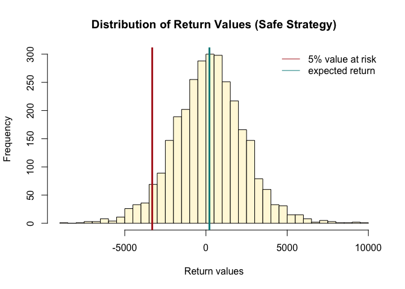
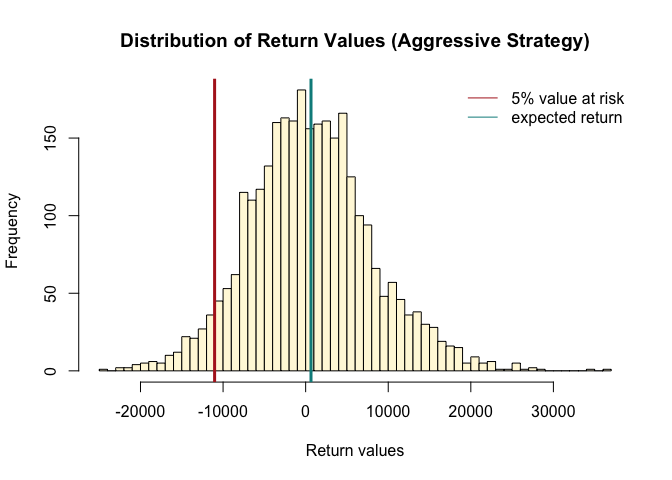

    library(quantmod)
    library(mosaic)
    library(foreach)
    library(pander)
    library(ggplot2)

    mystocks <- c("SPY", "TLT", "LQD", "EEM", "VNQ")
    getSymbols(mystocks)

    ## [1] "SPY" "TLT" "LQD" "EEM" "VNQ"

    SPYa <- adjustOHLC(SPY)
    TLTa <- adjustOHLC(TLT)
    LQDa <- adjustOHLC(LQD)
    EEMa <- adjustOHLC(EEM)
    VNQa <- adjustOHLC(VNQ)
    myreturns <- cbind(ClCl(SPY),ClCl(TLT),ClCl(LQD),ClCl(EEM),ClCl(VNQ))
    myreturns <- as.matrix(na.omit(myreturns))

    #Find the mean and standard deviation for each asset
    asset_return <- sort(apply(myreturns, 2,mean))
    asset_risk <- sort(apply(myreturns, 2, sd))
    asset_return_ns <- apply(myreturns, 2,mean)
    asset_risk_ns <- apply(myreturns, 2, sd)

### Expected Return for each asset

    pander(asset_return)

<table style="width:83%;">
<colgroup>
<col width="16%" />
<col width="16%" />
<col width="16%" />
<col width="16%" />
<col width="16%" />
</colgroup>
<thead>
<tr class="header">
<th align="center">ClCl.LQD</th>
<th align="center">ClCl.TLT</th>
<th align="center">ClCl.EEM</th>
<th align="center">ClCl.VNQ</th>
<th align="center">ClCl.SPY</th>
</tr>
</thead>
<tbody>
<tr class="odd">
<td align="center">5.968e-05</td>
<td align="center">0.0001739</td>
<td align="center">0.0002471</td>
<td align="center">0.0002626</td>
<td align="center">0.0002801</td>
</tr>
</tbody>
</table>

Now, we rank the five asset from lowest return to highest return based
on sample mean.

### Standard deviation of return for each asset

    pander(asset_risk)

<table style="width:76%;">
<colgroup>
<col width="15%" />
<col width="15%" />
<col width="15%" />
<col width="15%" />
<col width="15%" />
</colgroup>
<thead>
<tr class="header">
<th align="center">ClCl.LQD</th>
<th align="center">ClCl.TLT</th>
<th align="center">ClCl.SPY</th>
<th align="center">ClCl.EEM</th>
<th align="center">ClCl.VNQ</th>
</tr>
</thead>
<tbody>
<tr class="odd">
<td align="center">0.005467</td>
<td align="center">0.009422</td>
<td align="center">0.01281</td>
<td align="center">0.02058</td>
<td align="center">0.02203</td>
</tr>
</tbody>
</table>

Here, we rank them from lowest risk to highest risk based on sample
standard deviations of the assets.

From the above tables, we can classify our assets into different
categories. Any assets below the 3rd rank will be given a score low.
Those above the third rank will be given a score high, and the middle
rank will be given a score medium.

**SPY** - High return/ Medium risk

**TLT** - Medium return/ Low risk

**LQD** - Low return/ Low risk

**EEM** - Low return/ High risk

**VNQ** - High return/ High risk

**Correlation between assets' returns**

    cor_returns <- cor(myreturns)
    pander(cor_returns)

<table style="width:97%;">
<colgroup>
<col width="20%" />
<col width="15%" />
<col width="15%" />
<col width="15%" />
<col width="15%" />
<col width="15%" />
</colgroup>
<thead>
<tr class="header">
<th align="center"> </th>
<th align="center">ClCl.SPY</th>
<th align="center">ClCl.TLT</th>
<th align="center">ClCl.LQD</th>
<th align="center">ClCl.EEM</th>
<th align="center">ClCl.VNQ</th>
</tr>
</thead>
<tbody>
<tr class="odd">
<td align="center"><strong>ClCl.SPY</strong></td>
<td align="center">1</td>
<td align="center">-0.4441</td>
<td align="center">0.09985</td>
<td align="center">0.8771</td>
<td align="center">0.773</td>
</tr>
<tr class="even">
<td align="center"><strong>ClCl.TLT</strong></td>
<td align="center">-0.4441</td>
<td align="center">1</td>
<td align="center">0.4248</td>
<td align="center">-0.379</td>
<td align="center">-0.2603</td>
</tr>
<tr class="odd">
<td align="center"><strong>ClCl.LQD</strong></td>
<td align="center">0.09985</td>
<td align="center">0.4248</td>
<td align="center">1</td>
<td align="center">0.1198</td>
<td align="center">0.07149</td>
</tr>
<tr class="even">
<td align="center"><strong>ClCl.EEM</strong></td>
<td align="center">0.8771</td>
<td align="center">-0.379</td>
<td align="center">0.1198</td>
<td align="center">1</td>
<td align="center">0.6966</td>
</tr>
<tr class="odd">
<td align="center"><strong>ClCl.VNQ</strong></td>
<td align="center">0.773</td>
<td align="center">-0.2603</td>
<td align="center">0.07149</td>
<td align="center">0.6966</td>
<td align="center">1</td>
</tr>
</tbody>
</table>

We will decide our not only on asset's expected return and standard
deviation but also on its correlation with other assets. On one hand, if
an asset has high positive correlation with another asset, that means
they will make a riskier combination. On the other hand, if an asset has
negative correlation with another asset, they will make a safer
combination.

    plot(asset_return_ns, asset_risk_ns, pch = 19, cex = 3.5, col = "salmon", xlab = "Expected Return", ylab = "Risk(Standard Devation)",ylim = c(0,0.025), main = "Risk vs Return")
    text(asset_return_ns[1],asset_risk_ns[1]+0.002, "SPY")
    text(asset_return_ns[2],asset_risk_ns[2]+0.002, "TLT")
    text(asset_return_ns[3],asset_risk_ns[3]+0.002, "LQD")
    text(asset_return_ns[4],asset_risk_ns[4]+0.002, "EEM")
    text(asset_return_ns[5],asset_risk_ns[5]+0.002, "VNQ")

    #Create a function to simulate 20 trading day
    sim_stock <- function(myreturns, investment, endperiod, weights, num_sim){
        sim_result <- foreach(i=1:num_sim, .combine='rbind') %do% {
            totalwealth <- investment #reset totalwealth for every simulation
            horizon <- endperiod
            holdings <- weights * totalwealth
            for (today in 1:horizon) {
                return_today <- resample(myreturns, 1, orig.ids = FALSE)
                holdings <- holdings + return_today * holdings
                totalwealth <- sum(holdings)
                holdings <- weights * totalwealth #end of day. redistribute the wealth
            }
            totalwealth
        }
    }

### Setting values for our simulation

We have 100,000 to invest, and we will do our simulation for 20 days.

    investment <- 100000
    endperiod <- 20

For each of the strategy, we will adjust the weight accordingly.

### Even Split Strategy

We will assign equal weights to all five assets

    set.seed(1)
    weights <- c(0.2,0.2,0.2,0.2,0.2)
    even_strategy <- sim_stock(myreturns, investment, endperiod, weights, 3000)
    names(weights) <- mystocks
    pander(weights)

<table style="width:42%;">
<colgroup>
<col width="8%" />
<col width="8%" />
<col width="8%" />
<col width="8%" />
<col width="8%" />
</colgroup>
<thead>
<tr class="header">
<th align="center">SPY</th>
<th align="center">TLT</th>
<th align="center">LQD</th>
<th align="center">EEM</th>
<th align="center">VNQ</th>
</tr>
</thead>
<tbody>
<tr class="odd">
<td align="center">0.2</td>
<td align="center">0.2</td>
<td align="center">0.2</td>
<td align="center">0.2</td>
<td align="center">0.2</td>
</tr>
</tbody>
</table>

**Weight of each stock for the even split strategy**

### Safe Strategy

For this strategy, we will look at our classification of the five assets
and choose those with low risk properties. We will also include one
medium risk asset. For the weight, we will use 1/standard deviation as
the coefficients and normalize them to add up to 1. SPY, TLT, and LQD
are the three chosen assets.

    pander(cor_returns)

<table style="width:97%;">
<colgroup>
<col width="20%" />
<col width="15%" />
<col width="15%" />
<col width="15%" />
<col width="15%" />
<col width="15%" />
</colgroup>
<thead>
<tr class="header">
<th align="center"> </th>
<th align="center">ClCl.SPY</th>
<th align="center">ClCl.TLT</th>
<th align="center">ClCl.LQD</th>
<th align="center">ClCl.EEM</th>
<th align="center">ClCl.VNQ</th>
</tr>
</thead>
<tbody>
<tr class="odd">
<td align="center"><strong>ClCl.SPY</strong></td>
<td align="center">1</td>
<td align="center">-0.4441</td>
<td align="center">0.09985</td>
<td align="center">0.8771</td>
<td align="center">0.773</td>
</tr>
<tr class="even">
<td align="center"><strong>ClCl.TLT</strong></td>
<td align="center">-0.4441</td>
<td align="center">1</td>
<td align="center">0.4248</td>
<td align="center">-0.379</td>
<td align="center">-0.2603</td>
</tr>
<tr class="odd">
<td align="center"><strong>ClCl.LQD</strong></td>
<td align="center">0.09985</td>
<td align="center">0.4248</td>
<td align="center">1</td>
<td align="center">0.1198</td>
<td align="center">0.07149</td>
</tr>
<tr class="even">
<td align="center"><strong>ClCl.EEM</strong></td>
<td align="center">0.8771</td>
<td align="center">-0.379</td>
<td align="center">0.1198</td>
<td align="center">1</td>
<td align="center">0.6966</td>
</tr>
<tr class="odd">
<td align="center"><strong>ClCl.VNQ</strong></td>
<td align="center">0.773</td>
<td align="center">-0.2603</td>
<td align="center">0.07149</td>
<td align="center">0.6966</td>
<td align="center">1</td>
</tr>
</tbody>
</table>

Among the asset that has low standard deviation, we chose SPY, TLT, and
LQD in our safe strategy because SPY and TLT have -0.44 correlation
coefficient, suggesting a negative correlation. LQD and SPY have almost
0 correlation coefficient. Finally, LQD and TLT have about 0.4
correlation coefficient. It might seems counterintuitive at first that
we pick this asset. However, other combinations will include an asset
that has high correlation with SPY. As a result, we select LQD, TLT, and
SPY.

    set.seed(1)
    spy_coef <- 1/asset_risk[3]
    tlt_coef <- 1/asset_risk[2]
    lqd_coef <- 1/ asset_risk[1]
    total_coef <- spy_coef + tlt_coef + lqd_coef
    spy_coef <- spy_coef/total_coef
    tlt_coef <- tlt_coef/total_coef
    lqd_coef <- lqd_coef/total_coef
    weights <- c(spy_coef, tlt_coef,lqd_coef, 0, 0)
    safe_strategy <- sim_stock(myreturns, investment, endperiod, weights, 3000)
    names(weights) <- mystocks
    pander(weights)

<table style="width:54%;">
<colgroup>
<col width="12%" />
<col width="12%" />
<col width="12%" />
<col width="8%" />
<col width="8%" />
</colgroup>
<thead>
<tr class="header">
<th align="center">SPY</th>
<th align="center">TLT</th>
<th align="center">LQD</th>
<th align="center">EEM</th>
<th align="center">VNQ</th>
</tr>
</thead>
<tbody>
<tr class="odd">
<td align="center">0.2127</td>
<td align="center">0.2891</td>
<td align="center">0.4982</td>
<td align="center">0</td>
<td align="center">0</td>
</tr>
</tbody>
</table>

**Weight of each stock for the safe strategy**

### Aggressive Strategy

    pander(cor_returns)

<table style="width:97%;">
<colgroup>
<col width="20%" />
<col width="15%" />
<col width="15%" />
<col width="15%" />
<col width="15%" />
<col width="15%" />
</colgroup>
<thead>
<tr class="header">
<th align="center"> </th>
<th align="center">ClCl.SPY</th>
<th align="center">ClCl.TLT</th>
<th align="center">ClCl.LQD</th>
<th align="center">ClCl.EEM</th>
<th align="center">ClCl.VNQ</th>
</tr>
</thead>
<tbody>
<tr class="odd">
<td align="center"><strong>ClCl.SPY</strong></td>
<td align="center">1</td>
<td align="center">-0.4441</td>
<td align="center">0.09985</td>
<td align="center">0.8771</td>
<td align="center">0.773</td>
</tr>
<tr class="even">
<td align="center"><strong>ClCl.TLT</strong></td>
<td align="center">-0.4441</td>
<td align="center">1</td>
<td align="center">0.4248</td>
<td align="center">-0.379</td>
<td align="center">-0.2603</td>
</tr>
<tr class="odd">
<td align="center"><strong>ClCl.LQD</strong></td>
<td align="center">0.09985</td>
<td align="center">0.4248</td>
<td align="center">1</td>
<td align="center">0.1198</td>
<td align="center">0.07149</td>
</tr>
<tr class="even">
<td align="center"><strong>ClCl.EEM</strong></td>
<td align="center">0.8771</td>
<td align="center">-0.379</td>
<td align="center">0.1198</td>
<td align="center">1</td>
<td align="center">0.6966</td>
</tr>
<tr class="odd">
<td align="center"><strong>ClCl.VNQ</strong></td>
<td align="center">0.773</td>
<td align="center">-0.2603</td>
<td align="center">0.07149</td>
<td align="center">0.6966</td>
<td align="center">1</td>
</tr>
</tbody>
</table>

For this strategy, we will not be as diversified as the safe strategy.
Also, we will look mainly at assests which have high returns with
moderate to high risks. Coefficients will be adjusted based on the
expected return values.

We chose SPY and VNQ because they both have high returns and moderate to
high risk. They also have a positive correlation of 0.773, meaning that
they are risky but can yield high returns.

    set.seed(1)
    total_coef_a <- asset_return[4] + asset_return[5]
    spy_coef_a <- asset_return[4]/total_coef_a
    vnq_coef_a <- asset_return[5]/total_coef_a
    weights <- c(spy_coef_a, 0, 0, 0, vnq_coef_a)
    aggressive_strategy <- sim_stock(myreturns, investment, endperiod, weights, 3000)
    names(weights) <- mystocks
    pander(weights)

<table style="width:49%;">
<colgroup>
<col width="12%" />
<col width="8%" />
<col width="8%" />
<col width="8%" />
<col width="11%" />
</colgroup>
<thead>
<tr class="header">
<th align="center">SPY</th>
<th align="center">TLT</th>
<th align="center">LQD</th>
<th align="center">EEM</th>
<th align="center">VNQ</th>
</tr>
</thead>
<tbody>
<tr class="odd">
<td align="center">0.4839</td>
<td align="center">0</td>
<td align="center">0</td>
<td align="center">0</td>
<td align="center">0.5161</td>
</tr>
</tbody>
</table>

**Weight of each stock for the aggressive strategy**

### Distribution of return values for even split strategy

    profit_split <- even_strategy - investment
    var05_split <- qdata(profit_split, 0.05)[2]
    hist(profit_split, 60,col = "cornsilk", xlab = "Return values", main = "Distribution of Return Values (Even Split Strategy)")
    abline(v = var05_split, col = "firebrick", lwd = 3)
    abline(v = mean(profit_split), col = "cyan4", lwd = 3)
    legend("topright", 
           c("5% value at risk", "expected return"), 
           lty=c(1, 1), 
           col=c("firebrick","cyan4"), 
           bty = "n")

    var_mean_split <- c(var05_split, mean(profit_split),sd(profit_split))
    names(var_mean_split) <- c("Value at Risk at 5%", "Expected Return", "Standard Deviation of Return")
    pander(var_mean_split)

<table style="width:97%;">
<colgroup>
<col width="30%" />
<col width="25%" />
<col width="41%" />
</colgroup>
<thead>
<tr class="header">
<th align="center">Value at Risk at 5%</th>
<th align="center">Expected Return</th>
<th align="center">Standard Deviation of Return</th>
</tr>
</thead>
<tbody>
<tr class="odd">
<td align="center">-6589</td>
<td align="center">450.6</td>
<td align="center">4418</td>
</tr>
</tbody>
</table>

This shows us that if investors invest for 20 traiding days for this
portfolio, 5 percent of the time they will suffer a loss of 6600.
However, on average, they will receive around 491.

**Quantile Values**

    pander(quantile(profit_split))

<table style="width:54%;">
<colgroup>
<col width="12%" />
<col width="11%" />
<col width="11%" />
<col width="9%" />
<col width="9%" />
</colgroup>
<thead>
<tr class="header">
<th align="center">0%</th>
<th align="center">25%</th>
<th align="center">50%</th>
<th align="center">75%</th>
<th align="center">100%</th>
</tr>
</thead>
<tbody>
<tr class="odd">
<td align="center">-16151</td>
<td align="center">-2332</td>
<td align="center">345.1</td>
<td align="center">3036</td>
<td align="center">22167</td>
</tr>
</tbody>
</table>

The table suggests that the return value in for 20 trading days can
range from a loss of 16958 to a gain of 21481.

### Distribution of return values for safe strategy

    profit_safe <- safe_strategy - investment
    var05_safe <- qdata(profit_safe, 0.05)[2]
    hist(profit_safe, 60,col = "cornsilk", xlab = "Return values", main = "Distribution of Return Values (Safe Strategy)")
    abline(v = var05_safe, col = "firebrick", lwd = 3)
    abline(v = mean(profit_safe), col = "cyan4", lwd = 3)
    legend("topright", 
           c("5% value at risk", "expected return"), 
           lty=c(1, 1), 
           col=c("firebrick","cyan4"), 
           bty = "n")

    var_mean_safe <- c(var05_safe, mean(profit_safe), sd(profit_safe))
    names(var_mean_safe) <- c("Value at Risk at 5%", "Expected Return", "Standard Deviation of Return")
    pander(var_mean_safe)

<table style="width:97%;">
<colgroup>
<col width="30%" />
<col width="25%" />
<col width="41%" />
</colgroup>
<thead>
<tr class="header">
<th align="center">Value at Risk at 5%</th>
<th align="center">Expected Return</th>
<th align="center">Standard Deviation of Return</th>
</tr>
</thead>
<tbody>
<tr class="odd">
<td align="center">-3332</td>
<td align="center">281.8</td>
<td align="center">2167</td>
</tr>
</tbody>
</table>

This shows us that if investors invest for 20 traiding days for this
portfolio, 5 percent of the time they will suffer a loss of 3218.
However, on average, they will receive around 261.

**Quantile Values**

    pander(quantile(profit_safe))

<table style="width:53%;">
<colgroup>
<col width="11%" />
<col width="11%" />
<col width="11%" />
<col width="9%" />
<col width="9%" />
</colgroup>
<thead>
<tr class="header">
<th align="center">0%</th>
<th align="center">25%</th>
<th align="center">50%</th>
<th align="center">75%</th>
<th align="center">100%</th>
</tr>
</thead>
<tbody>
<tr class="odd">
<td align="center">-7990</td>
<td align="center">-1042</td>
<td align="center">304.7</td>
<td align="center">1644</td>
<td align="center">10935</td>
</tr>
</tbody>
</table>

The table suggests that the return value in for 20 trading days can
range from a loss of 9046 to a gain of 8677.

### Distribution of return values for agressive strategy

    profit_aggressive <- aggressive_strategy - investment
    var05_aggressive <- qdata(profit_aggressive, 0.05)[2]
    hist(profit_aggressive, 60,col = "cornsilk", xlab = "Return values", main = "Distribution of Return Values (Aggressive Strategy)")
    abline(v = var05_aggressive, col = "firebrick", lwd = 3)
    abline(v = mean(profit_aggressive), col = "cyan4", lwd = 3)
    legend("topright", 
           c("5% value at risk", "expected return"), 
           lty=c(1, 1), 
           col=c("firebrick","cyan4"), 
           bty = "n")

    var_mean_aggressive <- c(var05_aggressive, mean(profit_aggressive), sd(profit_aggressive))
    names(var_mean_aggressive) <- c("Value at Risk at 5%", "Expected Return", "Standard Deviation of Return")
    pander(var_mean_aggressive)

<table style="width:97%;">
<colgroup>
<col width="30%" />
<col width="25%" />
<col width="41%" />
</colgroup>
<thead>
<tr class="header">
<th align="center">Value at Risk at 5%</th>
<th align="center">Expected Return</th>
<th align="center">Standard Deviation of Return</th>
</tr>
</thead>
<tbody>
<tr class="odd">
<td align="center">-11182</td>
<td align="center">611</td>
<td align="center">7442</td>
</tr>
</tbody>
</table>

This shows us that if investors invest for 20 traiding days for this
portfolio, 5 percent of the time they will suffer a loss of 11065.
However, on average, they will receive around 724.

**Quantile Values**

    pander(quantile(profit_aggressive))

<table style="width:54%;">
<colgroup>
<col width="12%" />
<col width="11%" />
<col width="11%" />
<col width="9%" />
<col width="9%" />
</colgroup>
<thead>
<tr class="header">
<th align="center">0%</th>
<th align="center">25%</th>
<th align="center">50%</th>
<th align="center">75%</th>
<th align="center">100%</th>
</tr>
</thead>
<tbody>
<tr class="odd">
<td align="center">-25420</td>
<td align="center">-4185</td>
<td align="center">389.1</td>
<td align="center">4977</td>
<td align="center">37612</td>
</tr>
</tbody>
</table>

The table suggests that the return value in for 20 trading days can
range from a loss of 26063 to a gain of 37979.

### Summary

    final_table <- data.frame(rbind(var_mean_split, var_mean_safe, var_mean_aggressive))
    rownames(final_table) <- c("Split Strategy","Safe Strategy", "Aggressive Strategy")
    colnames(final_table) <- c("Value at Risk at 5%", "Expected Return", "Standard Deviation of Return")
    pander(final_table)

<table style="width:90%;">
<caption>Table continues below</caption>
<colgroup>
<col width="36%" />
<col width="30%" />
<col width="23%" />
</colgroup>
<thead>
<tr class="header">
<th align="center"> </th>
<th align="center">Value at Risk at 5%</th>
<th align="center">Expected Return</th>
</tr>
</thead>
<tbody>
<tr class="odd">
<td align="center"><strong>Split Strategy</strong></td>
<td align="center">-6589</td>
<td align="center">450.6</td>
</tr>
<tr class="even">
<td align="center"><strong>Safe Strategy</strong></td>
<td align="center">-3332</td>
<td align="center">281.8</td>
</tr>
<tr class="odd">
<td align="center"><strong>Aggressive Strategy</strong></td>
<td align="center">-11182</td>
<td align="center">611</td>
</tr>
</tbody>
</table>

<table style="width:78%;">
<colgroup>
<col width="36%" />
<col width="41%" />
</colgroup>
<thead>
<tr class="header">
<th align="center"> </th>
<th align="center">Standard Deviation of Return</th>
</tr>
</thead>
<tbody>
<tr class="odd">
<td align="center"><strong>Split Strategy</strong></td>
<td align="center">4418</td>
</tr>
<tr class="even">
<td align="center"><strong>Safe Strategy</strong></td>
<td align="center">2167</td>
</tr>
<tr class="odd">
<td align="center"><strong>Aggressive Strategy</strong></td>
<td align="center">7442</td>
</tr>
</tbody>
</table>
