    #have a brief idea of the data
    setwd("~/Downloads")
    mkt = read.csv("social_marketing.csv")
    summary(mkt)

    ##          X           chatter       current_events      travel      
    ##  123pxkyqj:   1   Min.   : 0.000   Min.   :0.000   Min.   : 0.000  
    ##  12grikctu:   1   1st Qu.: 2.000   1st Qu.:1.000   1st Qu.: 0.000  
    ##  12klxic7j:   1   Median : 3.000   Median :1.000   Median : 1.000  
    ##  12t4msroj:   1   Mean   : 4.399   Mean   :1.526   Mean   : 1.585  
    ##  12yam59l3:   1   3rd Qu.: 6.000   3rd Qu.:2.000   3rd Qu.: 2.000  
    ##  132y8f6aj:   1   Max.   :26.000   Max.   :8.000   Max.   :26.000  
    ##  (Other)  :7876                                                    
    ##  photo_sharing    uncategorized      tv_film      sports_fandom   
    ##  Min.   : 0.000   Min.   :0.000   Min.   : 0.00   Min.   : 0.000  
    ##  1st Qu.: 1.000   1st Qu.:0.000   1st Qu.: 0.00   1st Qu.: 0.000  
    ##  Median : 2.000   Median :1.000   Median : 1.00   Median : 1.000  
    ##  Mean   : 2.697   Mean   :0.813   Mean   : 1.07   Mean   : 1.594  
    ##  3rd Qu.: 4.000   3rd Qu.:1.000   3rd Qu.: 1.00   3rd Qu.: 2.000  
    ##  Max.   :21.000   Max.   :9.000   Max.   :17.00   Max.   :20.000  
    ##                                                                   
    ##     politics           food            family        home_and_garden 
    ##  Min.   : 0.000   Min.   : 0.000   Min.   : 0.0000   Min.   :0.0000  
    ##  1st Qu.: 0.000   1st Qu.: 0.000   1st Qu.: 0.0000   1st Qu.:0.0000  
    ##  Median : 1.000   Median : 1.000   Median : 1.0000   Median :0.0000  
    ##  Mean   : 1.789   Mean   : 1.397   Mean   : 0.8639   Mean   :0.5207  
    ##  3rd Qu.: 2.000   3rd Qu.: 2.000   3rd Qu.: 1.0000   3rd Qu.:1.0000  
    ##  Max.   :37.000   Max.   :16.000   Max.   :10.0000   Max.   :5.0000  
    ##                                                                      
    ##      music              news        online_gaming       shopping     
    ##  Min.   : 0.0000   Min.   : 0.000   Min.   : 0.000   Min.   : 0.000  
    ##  1st Qu.: 0.0000   1st Qu.: 0.000   1st Qu.: 0.000   1st Qu.: 0.000  
    ##  Median : 0.0000   Median : 0.000   Median : 0.000   Median : 1.000  
    ##  Mean   : 0.6793   Mean   : 1.206   Mean   : 1.209   Mean   : 1.389  
    ##  3rd Qu.: 1.0000   3rd Qu.: 1.000   3rd Qu.: 1.000   3rd Qu.: 2.000  
    ##  Max.   :13.0000   Max.   :20.000   Max.   :27.000   Max.   :12.000  
    ##                                                                      
    ##  health_nutrition  college_uni     sports_playing      cooking      
    ##  Min.   : 0.000   Min.   : 0.000   Min.   :0.0000   Min.   : 0.000  
    ##  1st Qu.: 0.000   1st Qu.: 0.000   1st Qu.:0.0000   1st Qu.: 0.000  
    ##  Median : 1.000   Median : 1.000   Median :0.0000   Median : 1.000  
    ##  Mean   : 2.567   Mean   : 1.549   Mean   :0.6392   Mean   : 1.998  
    ##  3rd Qu.: 3.000   3rd Qu.: 2.000   3rd Qu.:1.0000   3rd Qu.: 2.000  
    ##  Max.   :41.000   Max.   :30.000   Max.   :8.0000   Max.   :33.000  
    ##                                                                     
    ##       eco           computers          business         outdoors      
    ##  Min.   :0.0000   Min.   : 0.0000   Min.   :0.0000   Min.   : 0.0000  
    ##  1st Qu.:0.0000   1st Qu.: 0.0000   1st Qu.:0.0000   1st Qu.: 0.0000  
    ##  Median :0.0000   Median : 0.0000   Median :0.0000   Median : 0.0000  
    ##  Mean   :0.5123   Mean   : 0.6491   Mean   :0.4232   Mean   : 0.7827  
    ##  3rd Qu.:1.0000   3rd Qu.: 1.0000   3rd Qu.:1.0000   3rd Qu.: 1.0000  
    ##  Max.   :6.0000   Max.   :16.0000   Max.   :6.0000   Max.   :12.0000  
    ##                                                                       
    ##      crafts         automotive           art             religion     
    ##  Min.   :0.0000   Min.   : 0.0000   Min.   : 0.0000   Min.   : 0.000  
    ##  1st Qu.:0.0000   1st Qu.: 0.0000   1st Qu.: 0.0000   1st Qu.: 0.000  
    ##  Median :0.0000   Median : 0.0000   Median : 0.0000   Median : 0.000  
    ##  Mean   :0.5159   Mean   : 0.8299   Mean   : 0.7248   Mean   : 1.095  
    ##  3rd Qu.:1.0000   3rd Qu.: 1.0000   3rd Qu.: 1.0000   3rd Qu.: 1.000  
    ##  Max.   :7.0000   Max.   :13.0000   Max.   :18.0000   Max.   :20.000  
    ##                                                                       
    ##      beauty          parenting           dating            school       
    ##  Min.   : 0.0000   Min.   : 0.0000   Min.   : 0.0000   Min.   : 0.0000  
    ##  1st Qu.: 0.0000   1st Qu.: 0.0000   1st Qu.: 0.0000   1st Qu.: 0.0000  
    ##  Median : 0.0000   Median : 0.0000   Median : 0.0000   Median : 0.0000  
    ##  Mean   : 0.7052   Mean   : 0.9213   Mean   : 0.7109   Mean   : 0.7677  
    ##  3rd Qu.: 1.0000   3rd Qu.: 1.0000   3rd Qu.: 1.0000   3rd Qu.: 1.0000  
    ##  Max.   :14.0000   Max.   :14.0000   Max.   :24.0000   Max.   :11.0000  
    ##                                                                         
    ##  personal_fitness    fashion        small_business        spam        
    ##  Min.   : 0.000   Min.   : 0.0000   Min.   :0.0000   Min.   :0.00000  
    ##  1st Qu.: 0.000   1st Qu.: 0.0000   1st Qu.:0.0000   1st Qu.:0.00000  
    ##  Median : 0.000   Median : 0.0000   Median :0.0000   Median :0.00000  
    ##  Mean   : 1.462   Mean   : 0.9966   Mean   :0.3363   Mean   :0.00647  
    ##  3rd Qu.: 2.000   3rd Qu.: 1.0000   3rd Qu.:1.0000   3rd Qu.:0.00000  
    ##  Max.   :19.000   Max.   :18.0000   Max.   :6.0000   Max.   :2.00000  
    ##                                                                       
    ##      adult        
    ##  Min.   : 0.0000  
    ##  1st Qu.: 0.0000  
    ##  Median : 0.0000  
    ##  Mean   : 0.4033  
    ##  3rd Qu.: 0.0000  
    ##  Max.   :26.0000  
    ## 

    dim(mkt)

    ## [1] 7882   37

    colSums(mkt[2:37])

    ##          chatter   current_events           travel    photo_sharing 
    ##            34671            12030            12493            21256 
    ##    uncategorized          tv_film    sports_fandom         politics 
    ##             6408             8436            12564            14098 
    ##             food           family  home_and_garden            music 
    ##            11015             6809             4104             5354 
    ##             news    online_gaming         shopping health_nutrition 
    ##             9502             9528            10951            20235 
    ##      college_uni   sports_playing          cooking              eco 
    ##            12213             5038            15750             4038 
    ##        computers         business         outdoors           crafts 
    ##             5116             3336             6169             4066 
    ##       automotive              art         religion           beauty 
    ##             6541             5713             8634             5558 
    ##        parenting           dating           school personal_fitness 
    ##             7262             5603             6051            11524 
    ##          fashion   small_business             spam            adult 
    ##             7855             2651               51             3179

    #change the first column into index
    mkt2 = mkt[,-1]
    rownames(mkt2) <- mkt[,1]

    #drop some categories that are not meaningful
    drops <- c("chatter", "uncategorized", "spam", "adult")
    mkt3 = mkt2[ , !(names(mkt2) %in% drops)]
    sum = colSums(mkt3)
    sum

    ##   current_events           travel    photo_sharing          tv_film 
    ##            12030            12493            21256             8436 
    ##    sports_fandom         politics             food           family 
    ##            12564            14098            11015             6809 
    ##  home_and_garden            music             news    online_gaming 
    ##             4104             5354             9502             9528 
    ##         shopping health_nutrition      college_uni   sports_playing 
    ##            10951            20235            12213             5038 
    ##          cooking              eco        computers         business 
    ##            15750             4038             5116             3336 
    ##         outdoors           crafts       automotive              art 
    ##             6169             4066             6541             5713 
    ##         religion           beauty        parenting           dating 
    ##             8634             5558             7262             5603 
    ##           school personal_fitness          fashion   small_business 
    ##             6051            11524             7855             2651

    sum2 = sort(sum, decreasing = TRUE)
    sum2

    ##    photo_sharing health_nutrition          cooking         politics 
    ##            21256            20235            15750            14098 
    ##    sports_fandom           travel      college_uni   current_events 
    ##            12564            12493            12213            12030 
    ## personal_fitness             food         shopping    online_gaming 
    ##            11524            11015            10951             9528 
    ##             news         religion          tv_film          fashion 
    ##             9502             8634             8436             7855 
    ##        parenting           family       automotive         outdoors 
    ##             7262             6809             6541             6169 
    ##           school              art           dating           beauty 
    ##             6051             5713             5603             5558 
    ##            music        computers   sports_playing  home_and_garden 
    ##             5354             5116             5038             4104 
    ##           crafts              eco         business   small_business 
    ##             4066             4038             3336             2651

    #scale the data
    mkt_scaled <- scale(mkt3, center=TRUE, scale=TRUE) 

    #before using k-means, lets find the best k using elbow function
    wss <- (nrow(mkt_scaled)-1)*sum(apply(mkt_scaled,2,var))
    for (i in 2:15) wss[i] <- sum(kmeans(mkt_scaled, centers=i)$withinss)
    plot(1:15, wss, type="b", xlab="Number of Clusters", ylab="Within groups sum of squares")

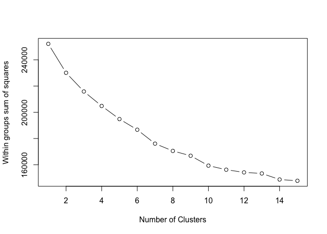

    #use 10 clusters
    cluster_all <- kmeans(mkt_scaled, centers=10, nstart=50)

    #add cluster to original data
    mkt3$cluster <- as.numeric(cluster_all$cluster)

    #Frequency of each cluster
    table(mkt3$cluster)

    ## 
    ##    1    2    3    4    5    6    7    8    9   10 
    ##  480  909  780  665  203  358  403  352  423 3309

    #creating individual datasets for analysis 
    #drop the four useless categories
    social_group1 = mkt[mkt3$cluster==1,c(2:37)]
    social_group1 = social_group1[ , !(names(social_group1) %in% drops)]

    social_group2 = mkt[mkt3$cluster==2,c(2:37)]
    social_group2 = social_group2[ , !(names(social_group2) %in% drops)]

    social_group3 = mkt[mkt3$cluster==3,c(2:37)]
    social_group3 = social_group3[ , !(names(social_group3) %in% drops)]

    social_group4 = mkt[mkt3$cluster==4,c(2:37)]
    social_group4 = social_group4[ , !(names(social_group4) %in% drops)]

    social_group5 = mkt[mkt3$cluster==5,c(2:37)]
    social_group5 = social_group5[ , !(names(social_group5) %in% drops)]

    social_group6 = mkt[mkt3$cluster==6,c(2:37)]
    social_group6 = social_group6[ , !(names(social_group6) %in% drops)]

    social_group7 = mkt[mkt3$cluster==7,c(2:37)]
    social_group7 = social_group7[ , !(names(social_group7) %in% drops)]

    social_group8 = mkt[mkt3$cluster==8,c(2:37)]
    social_group8 = social_group8[ , !(names(social_group8) %in% drops)]

    social_group9 = mkt[mkt3$cluster==9,c(2:37)]
    social_group9 = social_group9[ , !(names(social_group9) %in% drops)]

    social_group10 = mkt[mkt3$cluster==10,c(2:37)]
    social_group10 = social_group10[ , !(names(social_group10) %in% drops)]

    #plot each group
    library(ggplot2)
    qplot(x=names(social_group1), y=apply(social_group1, MARGIN=2, FUN=mean), xlab='Category',ylab='Average occurences') + geom_bar(stat = 'identity', fill = "firebrick2", color = "firebrick4")+ theme(axis.text.x = element_text(angle=90, hjust=1))

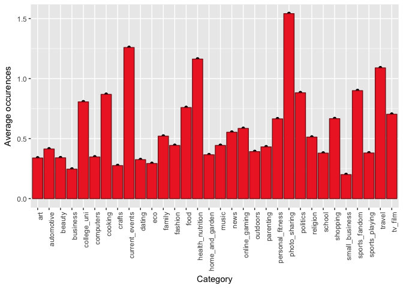
groups: politics, travel, computers segment: high-educated people who
like high technology

    qplot(x=names(social_group2), y=apply(social_group2, MARGIN=2, FUN=mean), xlab='Category',ylab='Average occurences') + geom_bar(stat = 'identity', fill = "firebrick2", color = "firebrick4")+ theme(axis.text.x = element_text(angle=90, hjust=1))

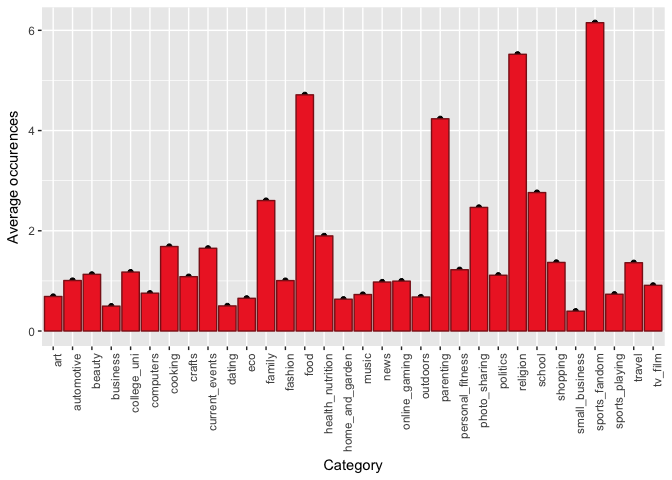
groups: sports\_fandom, religion, food, parenting market segment:
parents who like sports???

    qplot(x=names(social_group3), y=apply(social_group3, MARGIN=2, FUN=mean), xlab='Category',ylab='Average occurences') + geom_bar(stat = 'identity', fill = "firebrick2", color = "firebrick4")+ theme(axis.text.x = element_text(angle=90, hjust=1))

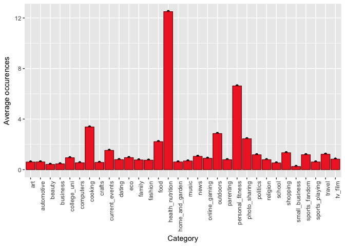
groups: photo\_sharing, shopping, current-events market segmentation:
young ladies who like fashion, catch up the trend

    qplot(x=names(social_group4), y=apply(social_group4, MARGIN=2, FUN=mean), xlab='Category',ylab='Average occurences') + geom_bar(stat = 'identity', fill = "firebrick2", color = "firebrick4")+ theme(axis.text.x = element_text(angle=90, hjust=1))

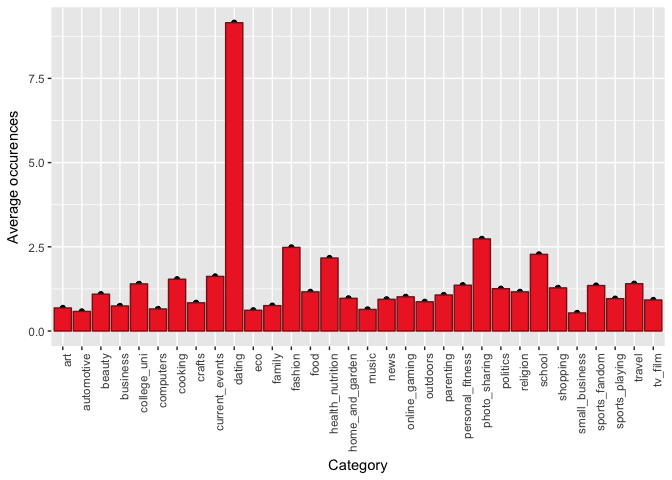
groups: news, politics, automotive market segment: mature male

    qplot(x=names(social_group5), y=apply(social_group5, MARGIN=2, FUN=mean), xlab='Category',ylab='Average occurences') + geom_bar(stat = 'identity', fill = "firebrick2", color = "firebrick4")+ theme(axis.text.x = element_text(angle=90, hjust=1))

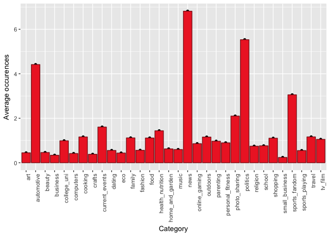
groups: cooking, fashion, photo\_sharing, beauty market segment: young
ladies, esp young mom

    qplot(x=names(social_group6), y=apply(social_group6, MARGIN=2, FUN=mean), xlab='Category',ylab='Average occurences') + geom_bar(stat = 'identity', fill = "firebrick2", color = "firebrick4")+ theme(axis.text.x = element_text(angle=90, hjust=1))

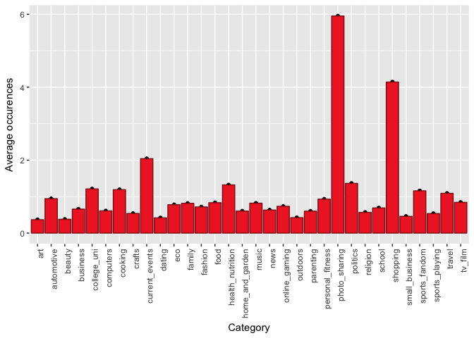
groups: dating, photo sharing market segment: young people

    qplot(x=names(social_group7), y=apply(social_group7, MARGIN=2, FUN=mean), xlab='Category',ylab='Average occurences') + geom_bar(stat = 'identity', fill = "firebrick2", color = "firebrick4")+ theme(axis.text.x = element_text(angle=90, hjust=1))

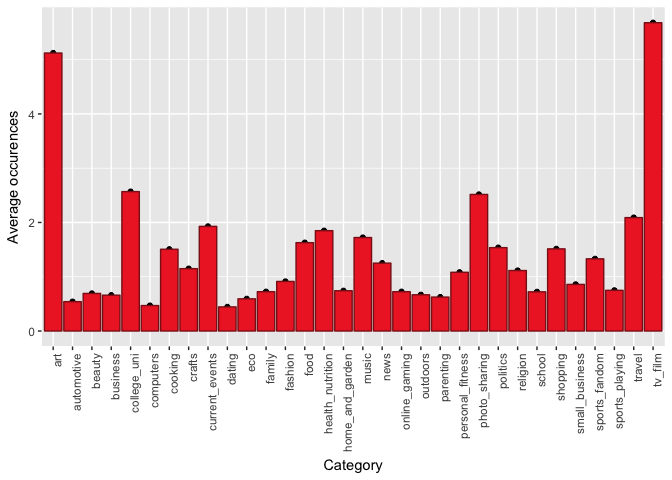
groups: college\_uni, online\_gaming market segmentation: college
students who like gaming

    qplot(x=names(social_group8), y=apply(social_group8, MARGIN=2, FUN=mean), xlab='Category',ylab='Average occurences') + geom_bar(stat = 'identity', fill = "firebrick2", color = "firebrick4")+ theme(axis.text.x = element_text(angle=90, hjust=1))

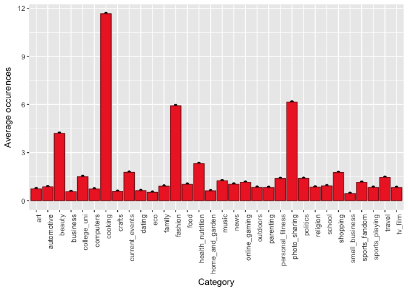
groups: tv\_film, art, college\_uni market segment: people who like arts

    qplot(x=names(social_group9), y=apply(social_group9, MARGIN=2, FUN=mean), xlab='Category',ylab='Average occurences') + geom_bar(stat = 'identity', fill = "firebrick2", color = "firebrick4")+ theme(axis.text.x = element_text(angle=90, hjust=1))

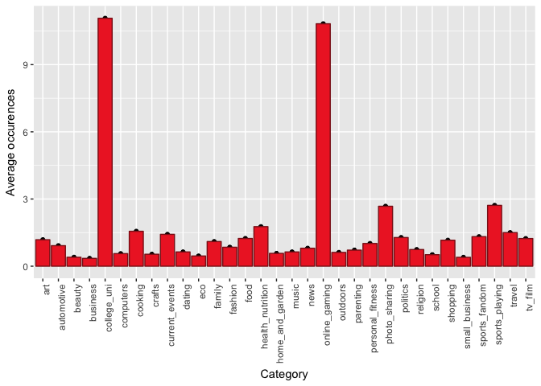
groups: health\_nutrition, personal\_fitness, cooking market segment:
people who care fitness

    qplot(x=names(social_group10), y=apply(social_group10, MARGIN=2, FUN=mean), xlab='Category',ylab='Average occurences') + geom_bar(stat = 'identity', fill = "firebrick2", color = "firebrick4")+ theme(axis.text.x = element_text(angle=90, hjust=1))

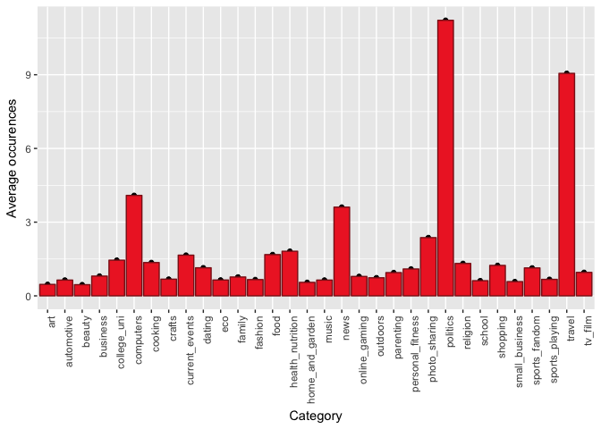
groups: photo\_sharing, current\_events, health\_nutrition, travel
market segment:

Overall, the target should be young people, well-educated people, who
cares social, fashion, fitness, current events.
